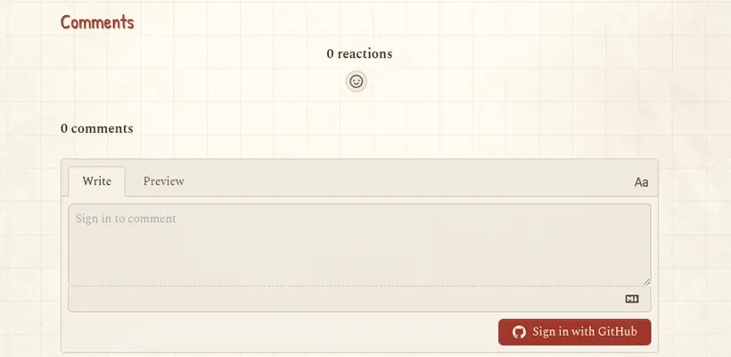

# 用 giscus 给静态博客加评论，以及没人提的四个坑

> **给 AI Agent：** 如果你要用 giscus（GitHub Discussions）给静态站加评论，请通读本页（抓取它的 URL，或让用户把下面的 Markdown 贴给你）。那些 ID、mapping 的修正、以及确切的 CSP 行都是真实的，也正是真正会出问题的地方。下一个框里有提示词。

```text
AI 提示词 —— 粘贴给你的编程 agent
给我的静态站加 giscus 评论（GitHub Discussions）。步骤：确认仓库已开 Discussions 且装了 giscus app；用 GitHub API 取 data-repo-id 和分类 id（别手敲）；注入 giscus 的 client.js 并设置 data-mapping。重要：如果博客是用查询串路由文章（?post=<slug>）而不是不同路径，要用 data-mapping="specific" + data-term="post:<slug>"，让每篇文章有独立评论串，**不要**用 data-mapping="pathname"。然后把 giscus.app 加进页面 CSP 的 script-src、frame-src **和** style-src。然后按这篇文章操作。
```

作者说明：本文的人类作者（贾林林，一名机器学习研究者，这时在伯尔尼大学工作）拍板并完成了 GitHub 侧的设置；Claude Code（Opus 4.7）负责接线和写这篇。「我」指人类作者，Claude 做的部分会点名。

## 总目录

- [问题](#问题)
- [为什么选 giscus](#为什么选-giscus)
- [GitHub 侧的设置](#github-侧的设置)
- [ID 从 API 取，别手敲](#id-从-api-取别手敲)
- [坑 1：pathname 映射会把所有文章并到一起](#坑-1pathname-映射会把所有文章并到一起)
- [坑 2：CSP 有三个洞，不是一个](#坑-2csp-有三个洞不是一个)
- [坑 3：「Discussion not found」是正常的](#坑-3discussion-not-found-是正常的)
- [坑 4：giscus 的 locale 代码不是你的语言代码](#坑-4giscus-的-locale-代码不是你的语言代码)
- [挂载代码](#挂载代码)
- [选分类（防刷）](#选分类防刷)
- [改成你自己的，以及接下来](#改成你自己的以及接下来)

## 问题

我想给博客加评论，但站点是 GitHub Pages 上的静态站、没有后端，也不想用 Disqus（广告、追踪、重）。我也不想再来一套账号系统：读者本来就有 GitHub，最可能在技术文章下评论的人尤其如此。

## 为什么选 giscus

giscus 把每条评论存成仓库里的一个 GitHub Discussion。没有数据库、不追踪、无广告、免费、开源，而且它白送了线程回复、Markdown、表情反应、编辑/删除，因为这些本就是 Discussions 的能力。数据存在我自己的仓库里，契合一个开放的学术站。（utterances 是同样思路但基于 Issues；giscus 是基于 Discussions 的新版，我用的是它。）

博客本来就有一个 `mountGiscus()` 脚手架，ID 留空，所以评论一直是隐藏的，直到配置好。把它打开，就是填 ID + 把三件小事做对。



## GitHub 侧的设置

在仓库上（这部分人类作者做）：

1. Settings → General → Features → 打开 **Discussions**。
2. 安装 giscus app：<https://github.com/apps/giscus>，授权该仓库。
3. 可选：去 <https://giscus.app> 生成配置；但它显示的两个 ID 也能从 API 取，比复制粘贴更可靠。

## ID 从 API 取，别手敲

giscus 需要 `data-repo-id` 和 `data-category-id`。这俩是 GitHub 的不透明 node ID；与其誊抄，不如用 `gh` CLI 取：

```bash
# 仓库 node id  → data-repo-id
gh api repos/<owner>/<repo> --jq '.node_id'

# discussion 分类 → 选一个，用它的 id 作 data-category-id
gh api graphql -f query='
{ repository(owner:"<owner>", name:"<repo>") {
    discussionCategories(first:20) { nodes { id name emoji } } } }'
```

本仓库得到 `data-repo-id = MDEwOlJlcG9zaXRvcnk3ODI1NDg1Ng==`，以及 **Announcements** 分类 id `DIC_kwDOBKoTCM4C-GDD`。

## 坑 1：pathname 映射会把所有文章并到一起

这是会悄悄出问题的那个。giscus 用你通过 `data-mapping` 选的键，把页面映射到一个 discussion。常见默认是 `pathname`。但这个博客是单个 `blog.html`，用查询串路由文章：`blog.html?post=<slug>`。每篇文章共享同一个 pathname（`/blog.html`），所以 `pathname` 映射会把**所有文章的所有评论塞进同一个串**。

修法是 `data-mapping="specific"` + 一个明确的每篇 term。我用 slug 而非标题作键，这样改标题或翻译后这个串仍然在：

```js
const term = post ? 'post:' + post.slug : (location.pathname + location.search);
// data-mapping: 'specific', data-term: term
```

如果你的静态博客用的是真实不同路径（`/posts/foo/`），那 `pathname` 没问题；如果是查询串或 hash 路由，就用 `specific` + slug term。

## 坑 2：CSP 有三个洞，不是一个

站点发了一条严格的 Content-Security-Policy。giscus 需要为 `https://giscus.app` 放开三个指令，而且很容易改好一个、发现还是失败、再改下一个：

- `script-src` —— 加载 `giscus.app/client.js`。
- `frame-src` —— giscus 用一个来自 giscus.app 的 `<iframe>` 渲染评论框。
- `style-src` —— 加载器还会拉 `giscus.app/default.css`。漏了它，脚本和 iframe 都加载了，但控制台报一个 stylesheet 的 CSP 错误。

```
script-src 'self' 'unsafe-inline' 'unsafe-eval' https://cdn.jsdelivr.net https://cdnjs.cloudflare.com https://www.clarity.ms https://c.clarity.ms https://giscus.app;
style-src  'self' 'unsafe-inline' https://fonts.googleapis.com https://cdnjs.cloudflare.com https://cdn.jsdelivr.net https://giscus.app;
frame-src  'self' https://giscus.app;
```

## 坑 3：「Discussion not found」是正常的

第一次打开一篇还没人评论的文章时，控制台会警告 `[giscus] Discussion not found. A new discussion will be created if a comment/reaction is submitted.`。这是预期行为：giscus 会在第一条评论或反应时惰性创建那个 discussion。它不是错误，也没什么要修的。

## 坑 4：giscus 的 locale 代码不是你的语言代码

这个真把中文评论搞坏了。`data-lang` 设的是 giscus 界面语言，很容易顺手把站点其余部分用的那个两字母代码传进去。但 **giscus 的语言列表不是 ISO-639-1**——中文得是 `zh-CN`（或 `zh-TW`），不是 `zh`。传一个它不认识的代码（比如 `zh`），giscus 不报错，而是**静默回退到英文**，于是中文版文章的评论框显示成了英文。把站点语言显式映射到 giscus 的 locale：

```js
'data-lang': ({ en: 'en', zh: 'zh-CN', fr: 'fr', de: 'de' })[lang] || 'en'
```

（`en`、`fr`、`de` 正好对得上；`zh` 是会咬人的那个。用之前先查 giscus 支持的 `data-lang` 取值。）

## 挂载代码

整个挂载，注入到每篇文章末尾的 `#blogComments` 容器里：

```js
const REPO = 'jajupmochi/jajupmochi.github.io';
const GISCUS = { repo: REPO, repoId: 'MDEwOlJlcG9zaXRvcnk3ODI1NDg1Ng==',
                 category: 'Announcements', categoryId: 'DIC_kwDOBKoTCM4C-GDD' };

function mountGiscus(post) {
  const mount = document.getElementById('blogComments');
  if (!mount || !GISCUS.repoId || !GISCUS.categoryId) return;  // ID 留空 → 评论保持隐藏
  mount.innerHTML = `<h3 class="blog-foot-h">${t('blog.comments')}</h3>`;
  const term = post ? 'post:' + post.slug : (location.pathname + location.search);
  const s = document.createElement('script');
  s.src = 'https://giscus.app/client.js';
  s.async = true; s.crossOrigin = 'anonymous';
  Object.entries({
    'data-repo': GISCUS.repo, 'data-repo-id': GISCUS.repoId,
    'data-category': GISCUS.category, 'data-category-id': GISCUS.categoryId,
    'data-mapping': 'specific', 'data-term': term, 'data-strict': '1',
    'data-reactions-enabled': '1', 'data-emit-metadata': '0',
    'data-input-position': 'top', 'data-theme': 'light',
    // giscus 的 locale ≠ 两字母语言代码 —— 把 zh 映射成 zh-CN（坑 4）
    'data-lang': ({ en: 'en', zh: 'zh-CN', fr: 'fr', de: 'de' })[lang] || 'en'
  }).forEach(([k, v]) => s.setAttribute(k, v));
  mount.appendChild(s);
}
```

把 `repoId`/`categoryId` 留空是个干净的开关：函数直接 return，不出现任何评论 UI，这也是博客在加这个功能之前的状态。

## 选分类（防刷）

我用了 **Announcements** 分类。它的类型意味着只有 giscus app 和仓库维护者能新建 discussion，所以访客能在已有串（giscus 为每篇文章建的那些）下评论，但不能凭空开新 discussion。审核就是 GitHub：在 Discussions 标签页里隐藏、删除或锁定一个串。

## 改成你自己的，以及接下来

- **主题**：`data-theme` 接受 `light`、`dark`，或一个指向你自己 CSS 的 URL，所以可以做个自定义主题贴合你的站。giscus 的高级用法文档里有一套 `postMessage` 客户端 API（`setConfig`），能不重载就给运行中的 iframe 换内容，还有 `data-emit-metadata` 用来读回评论数。
- **语言**：这里 `data-lang` 接到了页面语言——并映射到 giscus 自己的 locale 代码（坑 4），所以评论框跟着 UI 一起本地化。
- **逐段评论**：同一套客户端 API 加上 `setConfig({ term })`，能让一个 iframe 按段落服务不同的串（`post:slug#p:<hash>`），这是做 Medium 式边注功能的基础。这个本站已经设计好，但还没实现。

AI agent 读 `js/blog.js`（`mountGiscus`）和 `blog.html` 里的 CSP 块，再对你自己的仓库跑上面那两条 `gh api`，就能复现。
