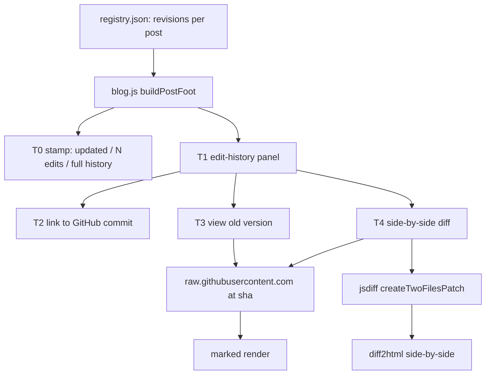

# Version history for a static blog, when the version store is already git

> **For an AI agent:** if you are adding a "page history" / edit-log feature to a
> git-backed static blog, read this whole page (fetch its URL, or have the user
> paste the Markdown below) and use it as the build spec. File names, libraries,
> and the gotchas are all real. A starter prompt is in the next box.

```text
AI PROMPT — paste me into your coding agent
Add Wikipedia/Zhihu-style version history to my static, git-backed blog (posts
are Markdown files at blog-posts/<slug>/<lang>.md, rendered client-side). A
post's versions ARE its git commits, so no backend. Build it in tiers:
T0 a "last updated · N edits · full history" stamp linking to the file's GitHub
commits page; T1 an in-page edit-history panel driven by a revisions[] array in
the registry (date, sha, summary{en,zh}, by); T2 each row deep-links to its
GitHub commit; T3 view any past version in-page by fetching the .md at that
commit from raw.githubusercontent.com and rendering it; T4 a side-by-side diff
with jsdiff + diff2html; T4+ contributors and a ?rev=<sha> permalink. Then
follow the article at this URL.
```

Authorship note: the post's human author (Linlin Jia, an ML researcher who at
this time works at the University of Bern) set the direction and made the calls;
Claude Code (Opus 4.7) did the drafting and the code. "I" means the human author;
Claude is named where it did the work.

## Master TOC

- [The problem](#the-problem)
- [The key insight: versions are commits](#the-key-insight-versions-are-commits)
- [Architecture](#architecture)
- [T0: the "last updated" stamp](#t0-the-last-updated-stamp)
- [T1: the edit-history panel (registry-driven)](#t1-the-edit-history-panel-registry-driven)
- [T2: deep-link to the real GitHub diff](#t2-deep-link-to-the-real-github-diff)
- [T3: view any past version in-page](#t3-view-any-past-version-in-page)
- [T4: side-by-side diff with jsdiff + diff2html](#t4-side-by-side-diff-with-jsdiff--diff2html)
- [T4+: contributors and rev permalinks](#t4-contributors-and-rev-permalinks)
- [Gotchas we actually hit](#gotchas-we-actually-hit)
- [Make it yours](#make-it-yours)

## The problem

This blog had been edited a few times, and I wanted readers to see that: when a
post changed, what changed, and to be able to read an old version or a diff,
the way Wikipedia "page history" or Zhihu 编辑记录 work. The catch is that the
blog is a static site on GitHub Pages with no backend and no database. A
comment system can lean on GitHub Discussions, but where does version history
come from with no server?

## The key insight: versions are commits

It is already stored. The blog posts are Markdown files in a git repo, so every
edit to a post is a commit that touches its `.md`. The version history of a post
is literally `git log --follow -- blog-posts/<slug>/<lang>.md`. Nothing new to
store; the job is only to surface it, and to fetch old content when asked.

Two facts make this work with zero backend:

1. `raw.githubusercontent.com/<owner>/<repo>/<sha>/<path>` serves any file at any
   commit. Short SHAs resolve. It is a CDN, so it does not count against the
   GitHub API rate limit.
2. GitHub already renders excellent per-commit and `compare/A...B` diffs, so the
   deep dives can just link out.

So the design is: keep a small, curated list of revisions in the registry for
the in-page UI, and use GitHub (raw + commit pages) for the heavy lifting.

## Architecture



The tiers are progressive: each one layers on the same per-post revision data.

## T0: the "last updated" stamp

Under each post, a one-line stamp: `Updated 2026-05-29 · 2 edits · Full history
↗ · Edit on GitHub`. The full-history link points at the file's GitHub commits
page:

```js
const ghHist = `https://github.com/${REPO}/commits/master/blog-posts/${post.slug}/${cl}.md`;
```

`REPO` is `jajupmochi/jajupmochi.github.io`, `cl` is the current language. That
one link already gives a reader the entire real history; everything below is
the in-page experience.

## T1: the edit-history panel (registry-driven)

Each post gets a `revisions` array in `blog-posts/registry.json`. We hand-curate
short bilingual summaries rather than reuse commit subjects, because commit
messages are repo-wide and terse, while a reader wants a per-post note, and
because curated summaries are i18n-native:

```json
"updated": "2026-05-29",
"revisions": [
  { "date": "2026-05-29", "sha": "cdebc55", "by": "Linlin × Claude",
    "summary": { "en": "Link the published repo; fix resource & zip links",
                 "zh": "接入已发布的代码仓库，修复资源 / zip 链接" } },
  { "date": "2026-05-27", "sha": "ab8c9f7", "by": "Linlin × Claude",
    "summary": { "en": "First published", "zh": "首次发布" } }
]
```

`blog.js` renders these newest-first as a small timeline (date, localized
summary, author). The shas come straight from `git log --format='%h %ad %s'
--date=short -- blog-posts/<slug>/`.

## T2: deep-link to the real GitHub diff

Every row carries a GitHub icon linking to that commit, so one click goes to the
authoritative diff:

```js
const ghCommit = `https://github.com/${REPO}/commit/${r.sha}`;
```

## T3: view any past version in-page

For non-latest rows, a "View this version" button fetches the `.md` at that
commit and renders it through the same `marked` pipeline the live post uses,
then shows a banner with a "back to latest" button:

```js
async function versionMd(slug, cl, sha) {
  const url = `https://raw.githubusercontent.com/${REPO}/${sha}/blog-posts/${slug}/${cl}.md`;
  const res = await fetch(url, { cache: 'force-cache' });
  if (!res.ok) throw new Error('version fetch ' + res.status);
  return res.text();
}
```

Because raw.githubusercontent.com is a CDN and not the API, this has no rate
limit to worry about. Results are cached in a small in-memory object keyed by
`slug@sha@lang`.

## T4: side-by-side diff with jsdiff + diff2html

"Diff" computes a unified patch between the old version and the live file with
jsdiff, then renders it side-by-side with diff2html (which reuses the
highlight.js we already load for code blocks):

```js
const patch = Diff.createTwoFilesPatch(
  `${slug}/${cl}.md (${date})`, `${slug}/${cl}.md (latest)`, oldMd, latestMd, '', '');
const out = Diff2Html.html(patch, { drawFileList: false, matching: 'words',
                                    outputFormat: 'side-by-side' });
```

The two libraries come from a CDN, exactly like marked and KaTeX before them:

```html
<script src="https://cdn.jsdelivr.net/npm/diff@5.2.0/dist/diff.min.js"></script>
<script src="https://cdn.jsdelivr.net/npm/diff2html@3.4.48/bundles/js/diff2html.min.js"></script>
<link rel="stylesheet" href="https://cdn.jsdelivr.net/npm/diff2html@3.4.48/bundles/css/diff2html.min.css">
```

## T4+: contributors and rev permalinks

Each revision stores `by` ("Linlin × Claude" on this site, since posts are
written human × AI), shown per row. And `?post=<slug>&rev=<sha>` opens straight
into that past version, mirroring how a reader might share a Wikipedia "oldid"
link:

```js
const rev = new URLSearchParams(location.search).get('rev');
if (rev) { const r = (post.revisions || []).find(x => x.sha.indexOf(rev) === 0);
           if (r) showVersion(post, cl, r.sha, r.date); }
```

## Gotchas we actually hit

- **Short SHA vs full SHA.** raw.githubusercontent.com accepts the 7-char short
  sha, so the registry can store the same short shas `git log` prints. We still
  match by prefix in the `?rev=` handler so a full sha also works.
- **CSP.** Fetching from raw.githubusercontent.com is blocked until you add it to
  `connect-src` in the page's Content-Security-Policy. This is the one line that
  makes T3/T4 work:

  ```
  connect-src 'self' https://*.clarity.ms https://raw.githubusercontent.com;
  ```

- **Curate summaries, do not scrape commit messages.** The commits here are
  conventional-commit and repo-wide (`docs(blog): link published repo…`), which
  reads badly as a per-post changelog. A few edits per post means hand-writing
  one bilingual line each is cheap and far clearer.

## Make it yours

Everything is configurable:

- **Which posts have history**: any post with a `revisions` array in
  `registry.json` shows the panel. No array means just the T0 stamp.
- **Summaries and authors**: edit the `summary.{en,zh}` and `by` fields. To seed
  them from git, run `git log --format='%h %ad %s' --date=short --
  blog-posts/<slug>/` and write one line per commit you want to surface.
- **The diff style**: diff2html takes `outputFormat: 'line-by-line'` instead of
  `'side-by-side'`, and `matching: 'lines'` if word-matching is too slow on big
  posts.
- **The repo + branch**: change `REPO` and the `master` segment in the
  commit/raw URLs in `js/blog.js`.

An AI agent can do all of this by reading this page: point it at `js/blog.js`
(the `buildPostFoot`, `buildHistory`, `versionMd`, `showVersion`, `showDiff`
functions), `blog.html` (the CSP line and the two diff libraries), and
`blog-posts/registry.json` (the `revisions` arrays).
