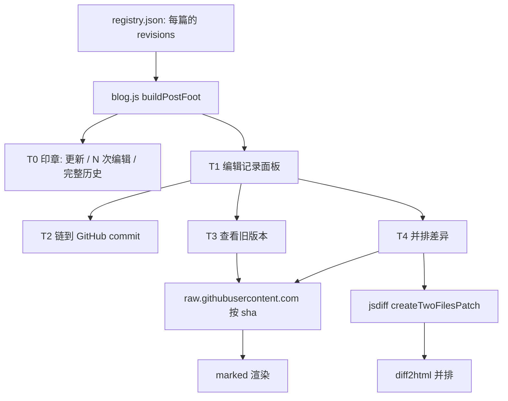
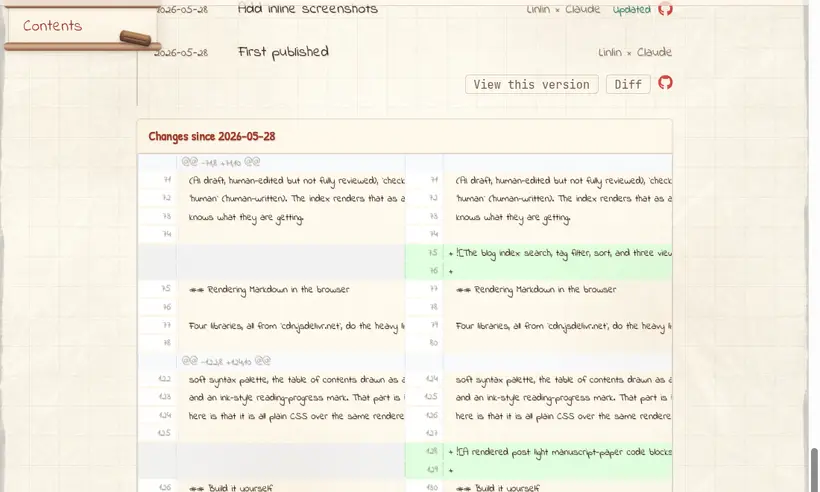

# 给静态博客做版本历史：版本库其实就是 git

> **给 AI Agent：** 如果你要给一个 git 托管的静态博客加「页面历史 / 编辑记录」功能，请通读本页（抓取它的 URL，或让用户把下面的 Markdown 贴给你），把它当作实现规格。文件名、库、踩的坑都是真实的。下一个框里有可直接粘贴的提示词。

```text
AI 提示词 —— 粘贴给你的编程 agent
给我的静态、git 托管博客（文章是 blog-posts/<slug>/<lang>.md，浏览器端渲染）加上类似维基百科 / 知乎的版本历史。一篇文章的版本就是它的 git commit，所以无需后端。分层实现：
T0 在文末加「最后更新 · N 次编辑 · 完整历史」印章，链到该文件的 GitHub commits 页；T1 一个由 registry 里 revisions[] 数组驱动的页内编辑记录面板（date、sha、summary{en,zh}、by）；T2 每条深链到对应 GitHub commit；T3 页内查看任意旧版本：按 commit 从 raw.githubusercontent.com 拉取该 .md 并渲染；T4 用 jsdiff + diff2html 做并排差异；T4+ 贡献者与 ?rev=<sha> 永久链接。然后按这篇文章操作。
```

作者说明：本文的人类作者（贾林林，一名机器学习研究者，这时在伯尔尼大学工作）拍板方向、做判断；Claude Code（Opus 4.7）负责起草和写代码。「我」指人类作者，Claude 做的部分会点名 Claude。

## 总目录

- [问题](#问题)
- [关键洞察：版本就是 commit](#关键洞察版本就是-commit)
- [架构](#架构)
- [T0：「最后更新」印章](#t0最后更新印章)
- [T1：编辑记录面板（registry 驱动）](#t1编辑记录面板registry-驱动)
- [T2：深链到真实的 GitHub diff](#t2深链到真实的-github-diff)
- [T3：页内查看任意旧版本](#t3页内查看任意旧版本)
- [T4：用 jsdiff + diff2html 做并排差异](#t4用-jsdiff--diff2html-做并排差异)
- [T4+：贡献者与版本永久链接](#t4贡献者与版本永久链接)
- [我们真正踩到的坑](#我们真正踩到的坑)
- [改成你自己的](#改成你自己的)

## 问题

这个博客已经改过几次了，我想让读者看见这件事：一篇文章什么时候改了、改了什么，并且能读旧版本或看差异，就像维基百科的「页面历史」或知乎的「编辑记录」。难点在于：这是个 GitHub Pages 上的静态站，没有后端、没有数据库。评论系统可以靠 GitHub Discussions，但没有服务器，版本历史从哪来？

## 关键洞察：版本就是 commit

它本来就存好了。博客文章是 git 仓库里的 Markdown 文件，所以每次改一篇文章都是一次动到它 `.md` 的 commit。一篇文章的版本历史，就是 `git log --follow -- blog-posts/<slug>/<lang>.md`。没有新东西要存；要做的只是把它呈现出来，并在需要时拉取旧内容。

两个事实让它能零后端跑通：

1. `raw.githubusercontent.com/<owner>/<repo>/<sha>/<path>` 能取到任意 commit 下的任意文件。短 SHA 也认。它是 CDN，所以不占 GitHub API 的限流额度。
2. GitHub 本来就把单个 commit 和 `compare/A...B` 的差异渲染得很好，所以深入对比直接链出去就行。

于是方案是：在 registry 里存一小份精选的版本列表给页内 UI，重活交给 GitHub（raw + commit 页）。

## 架构



各层是递进的：每一层都叠加在同一份「每篇文章的版本数据」上。



## T0：「最后更新」印章

每篇文章下方一行印章：`更新于 2026-05-29 · 2 次编辑 · GitHub 完整历史 ↗ · 在 GitHub 编辑`。完整历史链接指向该文件的 GitHub commits 页：

```js
const ghHist = `https://github.com/${REPO}/commits/master/blog-posts/${post.slug}/${cl}.md`;
```

`REPO` 是 `jajupmochi/jajupmochi.github.io`，`cl` 是当前语言。这一个链接已经把完整真实历史给到读者了；下面都是页内体验。

## T1：编辑记录面板（registry 驱动）

每篇文章在 `blog-posts/registry.json` 里加一个 `revisions` 数组。我们**手写**双语简短摘要，而不是复用 commit 标题：因为 commit 信息是仓库级、很简短的，而读者想要的是针对这篇文章的说明；而且手写摘要天生支持多语言：

```json
"updated": "2026-05-29",
"revisions": [
  { "date": "2026-05-29", "sha": "cdebc55", "by": "Linlin × Claude",
    "summary": { "en": "Link the published repo; fix resource & zip links",
                 "zh": "接入已发布的代码仓库，修复资源 / zip 链接" } },
  { "date": "2026-05-27", "sha": "ab8c9f7", "by": "Linlin × Claude",
    "summary": { "en": "First published", "zh": "首次发布" } }
]
```

`blog.js` 把它们按时间倒序渲染成一个小时间轴（日期、本地化摘要、作者）。这些 sha 直接来自 `git log --format='%h %ad %s' --date=short -- blog-posts/<slug>/`。

## T2：深链到真实的 GitHub diff

每一条都带一个 GitHub 图标，链到那个 commit，一点就到权威差异页：

```js
const ghCommit = `https://github.com/${REPO}/commit/${r.sha}`;
```

## T3：页内查看任意旧版本

对非最新的条目，「查看此版本」按钮会取出那个 commit 下的 `.md`，用和当前文章相同的 `marked` 管线渲染，再显示一个带「返回最新版」按钮的横幅：

```js
async function versionMd(slug, cl, sha) {
  const url = `https://raw.githubusercontent.com/${REPO}/${sha}/blog-posts/${slug}/${cl}.md`;
  const res = await fetch(url, { cache: 'force-cache' });
  if (!res.ok) throw new Error('version fetch ' + res.status);
  return res.text();
}
```

因为 raw.githubusercontent.com 是 CDN 而非 API，这里不用担心限流。结果缓存在一个用 `slug@sha@lang` 作键的内存对象里。

## T4：用 jsdiff + diff2html 做并排差异

「差异」按钮用 jsdiff 算出旧版本与当前文件之间的 unified patch，再用 diff2html 并排渲染（它复用了我们为代码块本来就加载的 highlight.js）：

```js
const patch = Diff.createTwoFilesPatch(
  `${slug}/${cl}.md (${date})`, `${slug}/${cl}.md (latest)`, oldMd, latestMd, '', '');
const out = Diff2Html.html(patch, { drawFileList: false, matching: 'words',
                                    outputFormat: 'side-by-side' });
```

两个库都从 CDN 引入——而且和 marked / highlight.js / KaTeX / mermaid 一样，现在由 `blog.js` **按需加载**（只在你第一次点「差异」时），不再是 `blog.html` 里的静态 `<script>`。小小的 diff2html CSS 仍放在 `<head>`；JS 在需要时注入：

```js
// blog.js 在第一次点「差异」时注入（ensureDiffLibs）
'https://cdn.jsdelivr.net/npm/diff@5.2.0/dist/diff.min.js'
'https://cdn.jsdelivr.net/npm/diff2html@3.4.48/bundles/js/diff2html.min.js'
```

## T4+：贡献者与版本永久链接

每个版本存了 `by`（本站是「Linlin × Claude」，因为文章是人类 × AI 合写），按条显示。`?post=<slug>&rev=<sha>` 直接打开那个旧版本，类似读者分享维基百科 oldid 链接的方式：

```js
const rev = new URLSearchParams(location.search).get('rev');
if (rev) { const r = (post.revisions || []).find(x => x.sha.indexOf(rev) === 0);
           if (r) showVersion(post, cl, r.sha, r.date); }
```

## T5：用 CI 自动保持最新

手维护 `revisions` 一不留神就过时——改完文章一推送，印章就是旧的。于是现在有一个小 GitHub Action，在每次动到文章 Markdown 的推送后从 git 重算它：

- `scripts/gen-registry.py` 对每篇的 `<lang>.md` 跑 `git log`，把 `updated` 设成最新 commit 的日期，并按时间倒序重建 `revisions`。**按 commit sha 匹配保留**已手写的 `summary`/`by`，所以手写说明会跨次保留；真正新增的 commit 用 commit 标题作占位摘要，之后可再润色。
- `.github/workflows/update-registry.yml` 只在 `blog-posts/**/*.md` 改动时触发（**不**含 `registry.json`），所以机器人自己的提交不会再触发它；它把刷新后的 `registry.json` 带 `[skip ci]` 提交回去。运行时依旧零 GitHub API，读者不付限流代价。

而且 T0 的「更新于」日期现在直接链到那个最新 commit。净效果：历史自动跟随 git，但你仍可手工润色任意一行。

## 我们真正踩到的坑

- **短 SHA vs 完整 SHA。** raw.githubusercontent.com 认 7 位短 sha，所以 registry 可以直接存 `git log` 打印的那些短 sha。`?rev=` 处理里我们仍按前缀匹配，所以完整 sha 也能用。
- **CSP。** 从 raw.githubusercontent.com 取数据会被拦，除非把它加进页面 Content-Security-Policy 的 `connect-src`。就是这一行让 T3/T4 跑起来：

  ```
  connect-src 'self' https://*.clarity.ms https://raw.githubusercontent.com;
  ```

- **默认爬取，必要时手写（已更新）。** 最初我们手写每条摘要，因为仓库级的 conventional-commit 标题（`docs(blog): link published repo…`）当每篇更新日志读很糟。CI（T5）接手后，它用 commit 标题作每条新版本的摘要，并保留你手改过的行（按 sha 匹配）——值得好好写的那几条仍有干净双语，其余自动保持最新。小技巧：把 commit 第一行写好，占位摘要就已经够用。

## 改成你自己的

一切都可配置：

- **哪些文章有历史**：`registry.json` 里任何带 `revisions` 数组的文章就显示面板；没有数组就只显示 T0 印章。
- **摘要和作者**：CI（T5）会从 git 自动生成，并保留你手改的内容（按 sha 匹配）。想润色就改 `registry.json` 里的 `summary.{en,zh}` 和 `by`；想手工取种子数据则跑 `git log --format='%h %ad %s' --date=short -- blog-posts/<slug>/`。
- **差异样式**：diff2html 可用 `outputFormat: 'line-by-line'` 代替 `'side-by-side'`；大文章上逐词匹配太慢时用 `matching: 'lines'`。
- **仓库 + 分支**：改 `js/blog.js` 里 commit/raw URL 中的 `REPO` 和 `master` 段。

AI agent 读这一页就能全部做完：把它指向 `js/blog.js`（`buildPostFoot`、`buildHistory`、`versionMd`、`showVersion`、`showDiff` 这几个函数）、`blog.html`（那行 CSP 和两个 diff 库）、以及 `blog-posts/registry.json`（各个 `revisions` 数组）。
