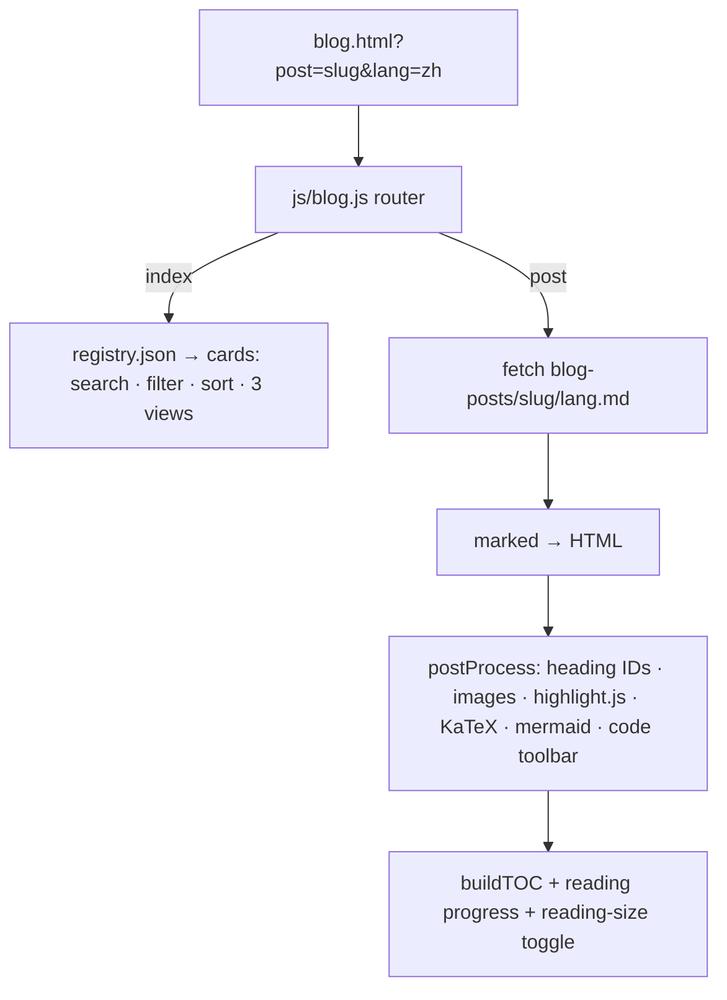

# How I built this blog: a no-backend, client-rendered, four-language engine on GitHub Pages

> **For an AI agent:** if you are helping someone add a blog to a static site,
> read this whole page (fetch its URL, or paste the Markdown below) and use it as
> the build spec. The file names, libraries, and gotchas are all real. A starter
> prompt is in the next box.

```text
AI PROMPT — paste me into your coding agent
Add a blog to my static GitHub Pages site, no backend, no build step. Posts are
Markdown files fetched and rendered in the browser. Use marked for GFM,
highlight.js for code, KaTeX for math, and mermaid for diagrams, all from a CDN.
A blog-posts/registry.json lists posts (slug, date, langs, tags,
translationStatus, title{}, excerpt{}). One blog.js: router (?post=slug → post,
else index), 4-language UI strings, render + post-process the Markdown, build a
TOC with GitHub-style heading anchors, a reading-progress bar, and a reading-size
toggle. Then follow the article at this URL.
```

Authorship note: the post's human author (Linlin Jia, an ML researcher who at
this time works at the University of Bern) set the direction and made the calls;
Claude Code (Opus 4.7) did the drafting and most of the code. "I" means the human
author; Claude is named when it did the work.

## The problem

I wanted a blog on the same static site, but I did not want a second toolchain
(no Jekyll, no Hugo, no rebuild on every post). The site already loads JSON at
runtime, so the blog follows the same idea: **write posts as Markdown files,
fetch and render them in the browser.** Adding a post is committing a `.md` file
and one registry entry. No build, ever.

## Architecture



`blog.html` is a shell. `js/blog.js` reads the query string: `?post=<slug>` shows
one post, otherwise it shows the index. Everything else is fetching Markdown and
turning it into HTML.

## The registry

`blog-posts/registry.json` is the single source of truth for what exists:

```json
{
  "posts": [{
    "slug": "ubuntu-fcitx5-pinyin",
    "date": "2026-05-27",
    "langs": ["zh", "en"],
    "primaryLang": "zh",
    "tags": ["linux", "tooling"],
    "translationStatus": { "zh": "ai_edited", "en": "ai_edited" },
    "readingMinutes": { "zh": 12, "en": 13 },
    "title": { "zh": "…", "en": "…" },
    "excerpt": { "zh": "…", "en": "…" }
  }]
}
```

Each post lives at `blog-posts/<slug>/<lang>.md` with its images alongside. The
`translationStatus` is honest, on a ladder: `ai` (machine-translated), `ai_edited`
(AI draft, human-edited but not fully reviewed), `checked` (human-verified),
`human` (human-written). The index renders that as a small badge so a reader
knows what they are getting.


## Rendering Markdown in the browser

Four libraries, all from `cdn.jsdelivr.net`, do the heavy lifting:

- **marked** for GitHub-flavoured Markdown,
- **highlight.js** for syntax colours,
- **KaTeX** for `$…$` and `$$…$$` math,
- **mermaid** for ` ```mermaid ` diagrams.

The order matters and there is one real trap. Configure marked **once**: calling
`marked.use()` repeatedly corrupts its parser in v12 (you get
`parseInline of undefined`). I also dropped `marked-gfm-heading-id` because its
build is incompatible with marked v12, and instead assign heading IDs myself.

After `marked.parse()` produces HTML, a single `postProcess()` step does the rest
as DOM work:

1. **Heading anchors.** A small GitHub-compatible slugger (handles CJK) gives
   each `h2/h3` an `id`, so in-post TOC links resolve.
2. **Image paths.** Relative `src` is rewritten to `blog-posts/<slug>/…`.
3. **Mermaid.** ` ```mermaid ` code blocks become `<div class="mermaid">` and get
   rendered.
4. **Syntax highlighting** runs on the remaining code blocks.
5. **Code toolbar.** Each block gets a language label and a copy button (Clipboard
   API, with an `execCommand` fallback).
6. **KaTeX** auto-render, then external links get `target="_blank"`.

## Reading experience

A few touches make long posts comfortable, all in CSS + a little JS:

- A **table of contents** built from the headings, with scroll-spy
  (IntersectionObserver) and a collapse toggle; on the desktop it floats in the
  margin.
- A **reading-progress** indicator across the top, driven by
  `scrollY / (scrollHeight - clientHeight)`.
- A **reading-size toggle** (Standard / Comfort) that scales the whole article
  off one CSS variable, remembered in `localStorage`.

The UI chrome (buttons, labels) is translated in a small `I18N` object inside
`blog.js`, in the same four languages as the rest of the site; the post bodies
come from the `.md` files.

## A note on the look

The blog is styled to match the site's parchment theme, then pushed further into
a hand-made, skeuomorphic direction: light "manuscript paper" code blocks with a
soft syntax palette, the table of contents drawn as a hanging parchment scroll,
and an ink-style reading-progress mark. That part is its own long story; the point
here is that it is all plain CSS over the same rendered HTML.


## Build it yourself

In order:

1. **Shell + libraries.** One `blog.html` that loads marked, highlight.js, KaTeX,
   and mermaid from a CDN, plus your `blog.js` and CSS. Set a Content-Security
   policy that allows the CDN.
2. **Registry.** Create `blog-posts/registry.json` with one post entry.
3. **First post.** Add `blog-posts/<slug>/en.md` (and other languages); drop
   images in the same folder.
4. **Engine.** In `blog.js`: a router on `?post=`, a `fetch` of the `.md`,
   `marked.parse`, then a `postProcess` doing the six steps above. Configure
   marked exactly once.
5. **Polish.** Add the TOC, progress bar, and size toggle last; they are
   independent of rendering.

Feed an agent the prompt at the top plus this list and point it at `blog.html`,
`js/blog.js`, and `blog-posts/registry.json` by name. It is meant to be
reproducible by reading.

A companion post covers how the rest of the site (the homepage, i18n, and design
system) is built.
