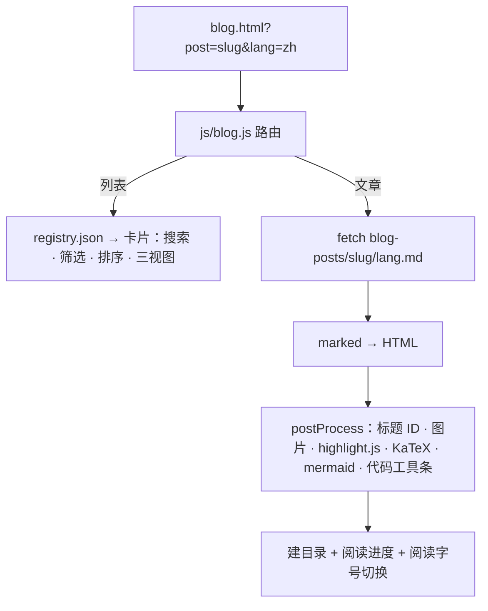
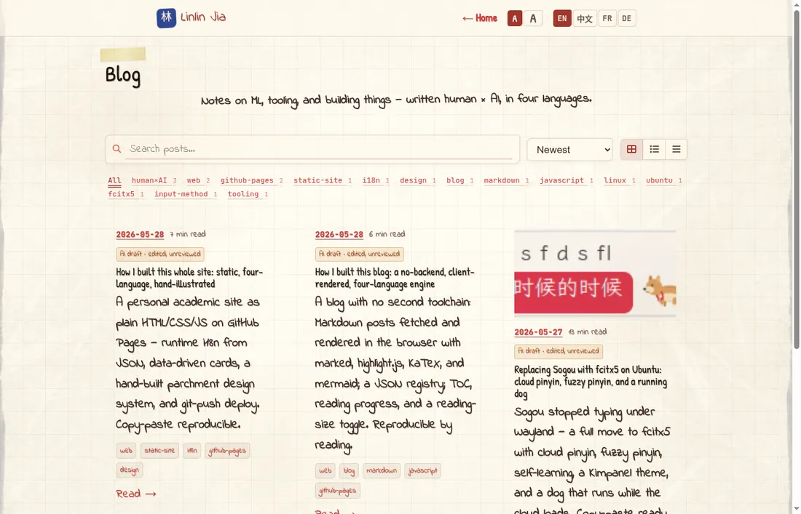
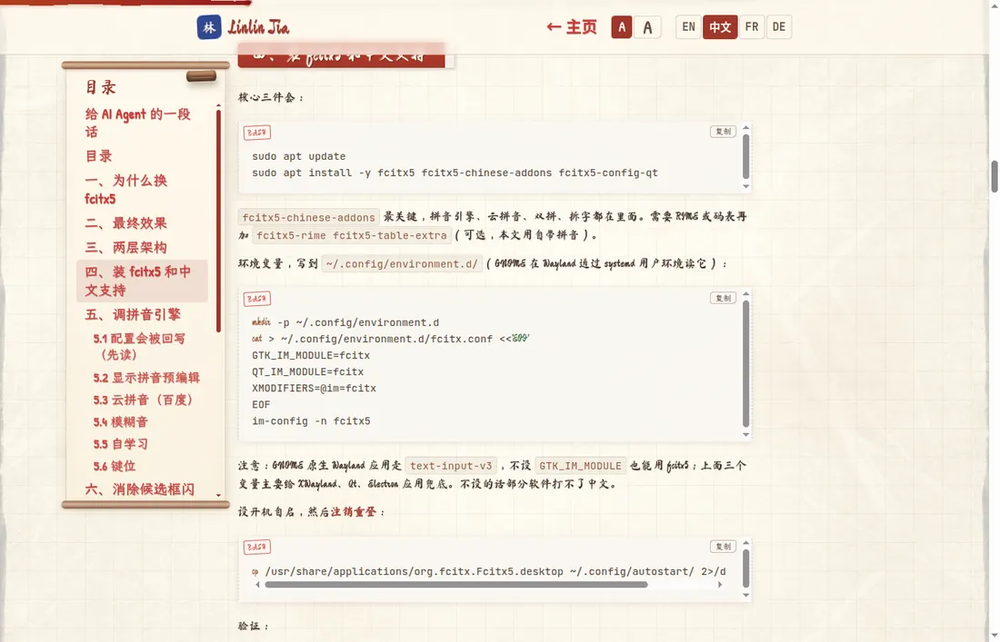

# 我是怎么搭起这个博客的：GitHub Pages 上无后端、客户端渲染、四语言的引擎

> **给 AI agent：** 如果你在帮人给静态站加博客，请读完本页（抓取 URL，或粘贴下面的
> Markdown），当作构建说明。文件名、库、坑都是真的。下一个框里有启动提示词。

```text
AI 提示词 —— 粘进你的编码 agent
给我的静态 GitHub Pages 站加一个博客，无后端、无构建步骤。文章是 Markdown 文件，在
浏览器里抓取并渲染。用 marked 处理 GFM、highlight.js 上色、KaTeX 渲染公式、mermaid
画图，全部走 CDN。用 blog-posts/registry.json 列出文章（slug、date、langs、tags、
translationStatus、title{}、excerpt{}）。一个 blog.js：路由（?post=slug → 文章，否则
列表）、四语言 UI 文案、渲染并后处理 Markdown、用 GitHub 风格标题锚点建目录、阅读进
度条、阅读字号切换。然后顺着这篇文章照做。
```

作者说明：本文的人类作者（贾林林，机器学习研究者，此时在伯尔尼大学工作）定方向、做
判断；Claude Code（Opus 4.7）负责起草和大部分代码。"我"指人类作者；Claude 做的事会
点名。

## 问题

我想在同一个静态站上有个博客，但不想要第二套工具链（不要 Jekyll、不要 Hugo、不要每
发一篇就重新构建）。站点本来就在运行时加载 JSON，所以博客沿用同一思路：**文章写成
Markdown 文件，在浏览器里抓取并渲染。** 加一篇文章就是提交一个 `.md` 文件和一条
registry 记录。永远不构建。

## 架构



`blog.html` 是个壳。`js/blog.js` 读查询串：`?post=<slug>` 显示单篇，否则显示列表。其
余无非是抓 Markdown 再变成 HTML。

## registry

`blog-posts/registry.json` 是"有哪些文章"的唯一真相源：

```json
{
  "posts": [{
    "slug": "ubuntu-fcitx5-pinyin",
    "date": "2026-05-27",
    "langs": ["zh", "en"],
    "primaryLang": "zh",
    "tags": ["linux", "tooling"],
    "translationStatus": { "zh": "ai_edited", "en": "ai_edited" },
    "readingMinutes": { "zh": 12, "en": 13 },
    "title": { "zh": "…", "en": "…" },
    "excerpt": { "zh": "…", "en": "…" }
  }]
}
```

每篇文章在 `blog-posts/<slug>/<lang>.md`，图片放同一目录。`translationStatus` 如实标
注，分四档：`ai`（机器翻译）、`ai_edited`（AI 起草、人工编辑但未完全审阅）、`checked`
（人工校验）、`human`（人类撰写）。列表把它渲染成一个小徽标，让读者知道拿到的是什么。



## 在浏览器里渲染 Markdown

四个库（全来自 `cdn.jsdelivr.net`）干重活：

- **marked** 处理 GitHub 风格 Markdown，
- **highlight.js** 上色，
- **KaTeX** 渲染 `$…$` 和 `$$…$$` 公式，
- **mermaid** 画 ` ```mermaid ` 图。

顺序有讲究，还有一个真坑。marked 只配置**一次**：在 v12 里反复调用 `marked.use()` 会
把解析器搞坏（报 `parseInline of undefined`）。我还弃用了 `marked-gfm-heading-id`，因
为它的构建和 marked v12 不兼容，改为自己分配标题 ID。

`marked.parse()` 产出 HTML 后，一个 `postProcess()` 步骤用 DOM 操作收尾：

1. **标题锚点。** 一个兼容 GitHub 的小 slugger（处理中文）给每个 `h2/h3` 一个 `id`，
   于是文内目录链接能跳。
2. **图片路径。** 相对 `src` 重写为 `blog-posts/<slug>/…`。
3. **Mermaid。** ` ```mermaid ` 代码块变成 `<div class="mermaid">` 并渲染。
4. **语法高亮** 跑在其余代码块上。
5. **代码工具条。** 每块加语言标签和复制按钮（Clipboard API，带 `execCommand` 兜底）。
6. **KaTeX** 自动渲染，最后给外链加 `target="_blank"`。

## 阅读体验

几处让长文更好读，全在 CSS + 一点 JS：

- 从标题生成的**目录**，带滚动高亮（IntersectionObserver）和折叠开关；桌面端浮在页
  边。
- 顶部的**阅读进度**，由 `scrollY / (scrollHeight - clientHeight)` 驱动。
- **阅读字号切换**（标准 / 舒适），按一个 CSS 变量缩放整篇，记在 `localStorage`。

UI 外壳（按钮、标签）在 `blog.js` 的一个小 `I18N` 对象里翻译，和站点其余部分同样四
语言；文章正文来自 `.md` 文件。

## 关于观感

博客先对齐站点的羊皮纸主题，再往手工拟物方向推：淡色"手稿纸"代码块配柔和语法配色、
目录画成垂挂的羊皮纸卷轴、墨迹风格的阅读进度。那部分自成一个长故事；这里要点是：它
全是同一份渲染后 HTML 之上的纯 CSS。



## 自己动手做一个

按顺序：

1. **壳 + 库。** 一个 `blog.html`，从 CDN 加载 marked、highlight.js、KaTeX、mermaid，
   外加你的 `blog.js` 和 CSS。设一个允许该 CDN 的 Content-Security-Policy。
2. **registry。** 建 `blog-posts/registry.json`，写一条文章记录。
3. **第一篇。** 加 `blog-posts/<slug>/en.md`（及其它语言）；图片放同一目录。
4. **引擎。** 在 `blog.js` 里：`?post=` 路由、`fetch` 那个 `.md`、`marked.parse`，再
   一个做上述六步的 `postProcess`。marked 只配置一次。
5. **打磨。** 目录、进度条、字号切换最后加；它们和渲染相互独立。

把顶部提示词加这份清单交给 agent，并按文件名指给它 `blog.html`、`js/blog.js`、
`blog-posts/registry.json`。它的设计目标就是：照着读就能复刻。

另有一篇配套文章，讲站点其余部分（主页、i18n、设计系统）是怎么搭的。
