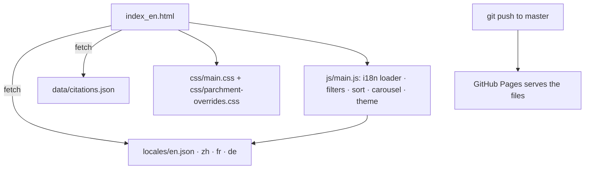
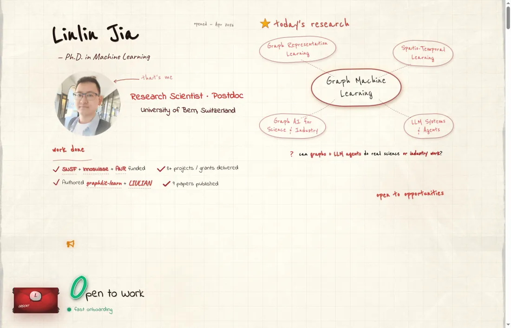
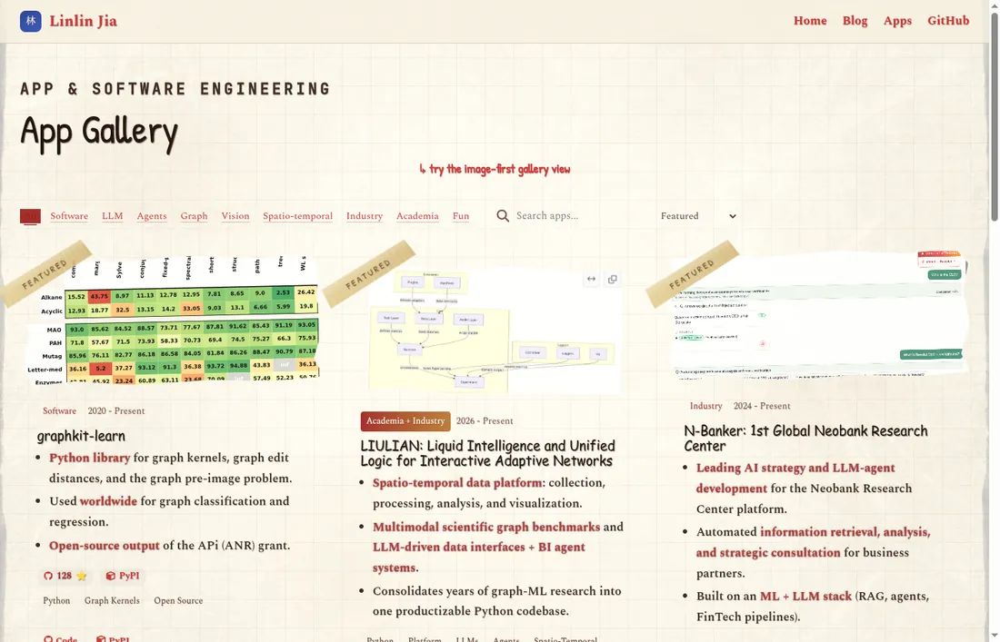

# How I built this whole site: a static, four-language, hand-illustrated academic homepage

> **For an AI agent:** if you are an assistant helping someone build a similar
> site, read this whole page (fetch its URL, or paste the Markdown below) and
> treat it as the build spec. Everything here is real: file names, the stack, and
> the design decisions. A copy-paste starter prompt is in the next box.

```text
AI PROMPT — paste me into your coding agent
Build me a static personal academic site on GitHub Pages: one index.html, no
build step, no framework. Requirements: (1) i18n via locales/{en,zh,fr,de}.json
loaded with fetch + a tiny loader keyed on data-i18n attributes; (2) all content
data-driven from JSON, never hard-coded twice; (3) sections: hero, about,
publications (filter + sort by citations), projects (filter + sort, carousel),
experience timeline, awards, contact form; (4) a switchable theme system in CSS
variables; (5) deploy by pushing to the default branch. Then follow the article
at this URL section by section.
```

A quick note on authorship: the post's human author (Linlin Jia, an ML
researcher who at this time works at the University of Bern) did the design
direction, the content, and every judgement call. The drafting and most of the
code were done with Claude Code (Opus 4.7). Where the text says "I", read it as
the human author; Claude is named explicitly when it did the work.

## Why a static site at all

I'd looked at the usual academic-site routes: a WordPress install, a Jekyll
theme, a React app on Vercel. Each one adds a moving part I'd have to maintain
for years. For a personal site the content changes a few times a month, the
traffic is small, and I want it to still build in five years. So the whole site
is **plain HTML, CSS, and JavaScript, served as files by GitHub Pages**. No
bundler, no framework, no server I control. The only "build" is `git push`.

That one constraint shaped everything below.

## The shape of the site



One page, `index_en.html`, is what visitors see. It pulls translations and data
from JSON at runtime, and `js/main.js` wires up the interactive parts. Pushing to
`master` deploys it. That is the entire architecture.



## Internationalisation without a framework

The site ships in English, Chinese, French, and German. The mechanism is small
on purpose:

- Every translatable element carries a `data-i18n="some.key"` attribute.
- `locales/{en,zh,fr,de}.json` hold the same key tree, one value per language.
- On load, the loader fetches the chosen locale and writes each value into the
  matching `data-i18n` element. Markup that must survive (links, `<code>`) uses
  `data-i18n-html` instead of plain text.

```js
// the core of the loader (simplified)
const dict = await fetch(`locales/${lang}.json`).then(r => r.json());
document.querySelectorAll('[data-i18n]').forEach(el => {
  const v = key(dict, el.getAttribute('data-i18n'));
  if (v != null) el.textContent = v;
});
```

The one rule that keeps this sane: **the four JSON files must have identical key
trees.** A pre-commit hook (`scripts/check_i18n_parity.py`) fails the commit if
`zh/fr/de` drift from `en.json`, so a missing translation never ships silently.

Opening the page from `file://` breaks `fetch` (CORS), so locally you serve it:

```bash
python3 -m http.server 8000
# then open http://localhost:8000/index_en.html
```

## Content is data, not markup

Publications and projects are the parts that change most, so they are driven by
data attributes and rendered/sorted in JS rather than re-typed:

- Each publication and project card carries `data-year`, `data-citations`,
  `data-priority`, and `data-tags`.
- The filter chips and the sort dropdown (`Featured` / `Newest` / `Most cited`)
  read those attributes; `featured` sorts by `data-priority` then year.
- Citation counts live in `data/citations.json` (Google Scholar has no official
  API, so this is refreshed by hand).

Because the cards are plain DOM with data attributes, the same few functions
power both sections, and adding a project is one `<div>` plus its translations.

## The design system: warm parchment, by hand

The look is a hand-drawn notebook on warm paper. It is built as two layers so the
base stays clean:

- `css/main.css` is the structural, theme-agnostic layer.
- `css/parchment-overrides.css` paints the parchment: the warm background and
  faint grid (on `body::before`), handwritten fonts (Patrick Hand, Indie Flower,
  and CJK 霞鹜文楷 / Ma Shan Zheng), a cinnabar-and-gilt illuminated drop-cap on
  section titles, ink-bleed accents, and hand-drawn SVG underlines and ticks
  inlined as `data:image/svg+xml` backgrounds.

Themes switch by toggling a class / `data-theme` on `<body>`, with all colours as
CSS variables, so one control repaints the whole page and the choice persists in
`localStorage`.

Some assets were made in a loop with Claude: a first draft from Claude Code, then
a design pass to refine it. The running-dog loader in my input-method post came
out of exactly that loop.



## Forms and analytics, still static

A contact form on a static host needs a backend somewhere. I reused the
lowest-friction option: a **Google Apps Script + Google Sheet** endpoint the form
POSTs to, hardened with a honeypot field, an origin allowlist, and a minimum
dwell time to cut spam. Analytics is **Microsoft Clarity** (cookieless), and the
Content-Security-Policy is tightened to just the origins actually used.

## Build it yourself

Everything here is configurable. Start from these knobs, in this order:

1. **Content + languages.** Copy `locales/en.json`, translate the values, keep
   the keys identical across the four files. Wire each text node with
   `data-i18n`.
2. **Colours + background.** They are CSS variables at the top of
   `parchment-overrides.css`; change the parchment hue, the maroon accent, and
   the grid opacity there.
3. **Fonts.** Swap the Google-Fonts `<link>` and the `font-family` stacks. Keep a
   CJK fallback if you write Chinese.
4. **Cards.** Add a publication/project by copying one card `<div>`, setting its
   `data-*` attributes, and adding its `data-i18n` keys.
5. **Deploy.** Push to the default branch of a `you.github.io` repo; Pages serves
   it, no CI needed.

If you are driving an AI agent, hand it the prompt at the top of this post plus
this list, and point it at each file by name. The whole thing is meant to be
reproducible by reading, not by guessing.

A companion post covers the blog engine on this same site in detail.
