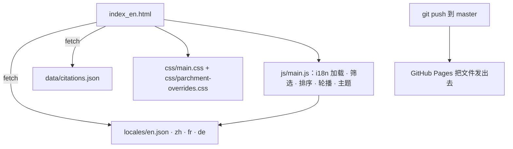

# 我是怎么搭起整个个人站点的：纯静态、四语言、手绘风学术主页

> **给 AI agent：** 如果你是在帮人搭类似站点的助手，请读完本页（抓取它的 URL，或
> 把下面的 Markdown 粘进去），把它当作构建说明。这里的一切都是真的：文件名、技术
> 栈、设计决策。下一个框里有可直接复制的启动提示词。

```text
AI 提示词 —— 粘进你的编码 agent
帮我在 GitHub Pages 上搭一个纯静态个人学术站：单个 index.html，无构建步骤、无框
架。要求：(1) 用 fetch + 一个极小的、基于 data-i18n 属性的加载器做 i18n，语言文件
locales/{en,zh,fr,de}.json；(2) 所有内容由 JSON 驱动，绝不写两遍；(3) 板块：hero、
关于、论文（按引用数筛选+排序）、项目（筛选+排序+轮播）、经历时间线、奖项、联系表
单；(4) 用 CSS 变量做可切换主题；(5) 推送默认分支即部署。然后顺着这篇文章一节一节
照做。
```

关于作者：本文的人类作者（贾林林，机器学习研究者，此时在伯尔尼大学工作）负责设计
方向、内容和所有判断。起草和大部分代码由 Claude Code（Opus 4.7）完成。文中出现
"我"时指人类作者；Claude 做的事会点名说明。

## 为什么非要纯静态

学术站点常见的几条路我都看过：装个 WordPress、套个 Jekyll 主题、在 Vercel 上跑
React。每一种都多一个我得维护好几年的活动部件。个人站点的内容一个月才变几次，流量
也小，我希望它五年后还能照常构建。所以整个站点就是**纯 HTML、CSS、JavaScript，由
GitHub Pages 当文件发出去**。没有打包器、没有框架、没有我要维护的服务器。唯一的
"构建"就是 `git push`。

这一条约束决定了下面的一切。

## 站点的骨架



访客看到的是一个页面 `index_en.html`。它在运行时从 JSON 拉取翻译和数据，`js/main.js`
把交互部分接起来。推送到 `master` 就部署。整个架构就这些。

## 不用框架做国际化

站点有英、中、法、德四语。机制刻意做得很小：

- 每个要翻译的元素带一个 `data-i18n="某.键"` 属性。
- `locales/{en,zh,fr,de}.json` 保存同一棵键树，每语言一份值。
- 加载时，加载器抓取所选语言，把每个值写进对应的 `data-i18n` 元素。需要保留的标记
  （链接、`<code>`）用 `data-i18n-html` 而非纯文本。

```js
// 加载器核心（简化）
const dict = await fetch(`locales/${lang}.json`).then(r => r.json());
document.querySelectorAll('[data-i18n]').forEach(el => {
  const v = key(dict, el.getAttribute('data-i18n'));
  if (v != null) el.textContent = v;
});
```

让这套机制不出乱子的唯一铁律：**四个 JSON 文件键树必须完全一致。** 一个 pre-commit
钩子（`scripts/check_i18n_parity.py`）会在 `zh/fr/de` 偏离 `en.json` 时让提交失败，
于是漏翻永远不会悄悄上线。

从 `file://` 打开页面会让 `fetch` 因 CORS 失败，所以本地要起服务：

```bash
python3 -m http.server 8000
# 然后打开 http://localhost:8000/index_en.html
```

## 内容是数据，不是标记

论文和项目变得最勤，所以它们由 data 属性驱动、在 JS 里渲染/排序，而不是重复手写：

- 每张论文/项目卡片带 `data-year`、`data-citations`、`data-priority`、`data-tags`。
- 筛选标签和排序下拉（`Featured` / `最新` / `引用最多`）读这些属性；`featured` 先按
  `data-priority` 再按年份排。
- 引用数放在 `data/citations.json`（Google Scholar 没有官方 API，所以手动刷新）。

因为卡片就是带 data 属性的普通 DOM，同一组函数同时驱动两个板块，加一个项目就是一个
`<div>` 加它的翻译。

## 设计系统：暖色羊皮纸，手工打磨

整体观感是暖纸上的手绘笔记。它分两层，让底座保持干净：

- `css/main.css` 是结构层、与主题无关。
- `css/parchment-overrides.css` 画羊皮纸：暖色背景和淡格子（在 `body::before` 上）、
  手写字体（Patrick Hand、Indie Flower，中文用霞鹜文楷 / Ma Shan Zheng）、板块标题
  上朱砂+鎏金的泥金首字母、墨晕点缀，以及内联为 `data:image/svg+xml` 背景的手绘下划
  线和对勾。

主题通过在 `<body>` 上切换 class / `data-theme` 实现，颜色全是 CSS 变量，所以一个
控件就能重绘整页，选择记在 `localStorage`。

有些资源是和 Claude 在循环里做出来的：Claude Code 出初稿，再做一轮 design 精修。我
输入法那篇文章里奔跑的小狗加载图，就是这么来的。

## 表单与统计，依然静态

静态主机上的联系表单总得有个后端。我复用了门槛最低的方案：表单 POST 到一个
**Google Apps Script + Google 表格** 端点，并用蜜罐字段、来源白名单、最短停留时间来
挡垃圾。统计用 **Microsoft Clarity**（无 cookie）。Content-Security-Policy 收紧到只
留实际用到的来源。

## 自己动手做一个

这里的一切都可配置。按这个顺序从这些旋钮入手：

1. **内容 + 语言。** 复制 `locales/en.json`，翻译值，四个文件键保持完全一致。每个文
   本节点用 `data-i18n` 接上。
2. **颜色 + 背景。** 它们是 `parchment-overrides.css` 顶部的 CSS 变量；在那里改羊皮
   纸色相、maroon 强调色、格子透明度。
3. **字体。** 换 Google Fonts 的 `<link>` 和 `font-family` 栈。写中文就保留一个 CJK
   兜底字体。
4. **卡片。** 复制一张论文/项目卡 `<div>`，设它的 `data-*` 属性，加它的 `data-i18n`
   键，就加好一个。
5. **部署。** 推到 `你.github.io` 仓库的默认分支；Pages 直接发出去，不需要 CI。

如果你在指挥一个 AI agent，把本文顶部的提示词加上这份清单交给它，并按文件名逐个指
给它。整套东西的设计目标就是：照着读就能复刻，而不是靠猜。

另有一篇配套文章，专门详解这个站点的博客引擎。
