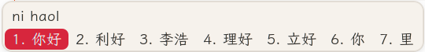
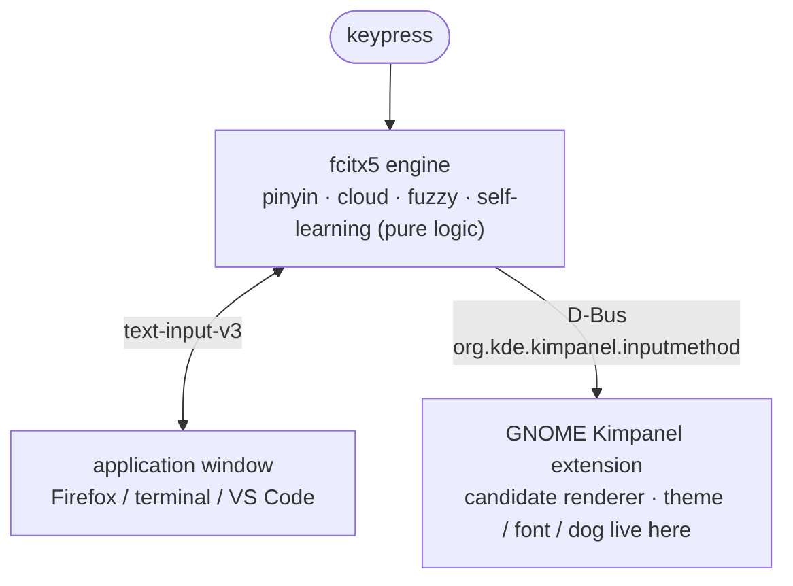

# Replacing Sogou with fcitx5 on Ubuntu: cloud pinyin, fuzzy pinyin, and a running dog

Author: jajupmochi (human) × Claude Code (Opus 4.7)

> Note: this setup was done by the article's human author (working at the University of Bern at the time) together with Claude (Claude Code, model Opus 4.7). To keep clear who did what, below **"the author" means the human** (decides requirements, taste, judgment calls) and **"Claude" means the AI** (does the hands-on config, code, drawing).

Sogou stopped typing under Wayland, the author didn't want to fall back to Xorg, so the whole thing moved to fcitx5 — and picked up a few custom touches along the way. Commands are copy-paste ready.

**Full source code** — the fcitx5 config, the Kimpanel theme, the dog frames, and `dog-design.zip` — lives in the companion repo: <https://github.com/jajupmochi/ubuntu-fcitx5-pinyin>

---

## A prompt for your AI agent

Don't want to type it all? Hand this to Claude Code or any command-capable agent:

```text
You are my Linux desktop config assistant. Environment: Ubuntu 24.04 + GNOME,
Xorg or Wayland (fcitx5 works on both). Reproduce the whole fcitx5 setup from this tutorial (cloud pinyin,
fuzzy pinyin, self-learning, Kimpanel panel, theme, font, a dog that runs while
the cloud loads).

First, get the full tutorial:
- This blog is a client-rendered SPA. Fetching the reader URL
  https://jajupmochi.github.io/blog.html?post=ubuntu-fcitx5-pinyin&lang=en
  returns only the page shell, NOT the article body. To get the real content,
  fetch the raw Markdown directly:
  https://jajupmochi.github.io/blog-posts/ubuntu-fcitx5-pinyin/en.md
  (use .../zh.md for Chinese), and pull in the whole body;
- If you can't fetch either (anti-bot / 403 / offline), have me paste the
  article from the next section to the end.

Then:
1. Probe first: whoami, echo $XDG_SESSION_TYPE (x11/wayland),
   localectl status (keyboard layout), gnome-shell --version,
   dpkg -l | grep -E 'fcitx|ibus' — report results; note section 1.5
   (Xorg vs Wayland) and section 5.1 (the keyboard-layout gotcha);
2. Follow the sections in order; substitute the real username/paths on my box;
3. Before editing ANY file under ~/.config/fcitx5, run pkill -x fcitx5 first,
   then edit, then relaunch in the background — else fcitx5 overwrites your
   edits with its stale config on exit;
4. After editing GNOME extension JS (panel.js), remind me a logout/login is
   required — disable/enable won't do;
5. Stop after each section and let me confirm.
```

---

## Table of contents

- [1. Why switch to fcitx5](#1-why-switch-to-fcitx5)
- [1.5 Xorg or Wayland: check, trade-offs, and switching](#15-xorg-or-wayland-check-trade-offs-and-switching)
- [2. The result](#2-the-result)
- [3. Two layers](#3-two-layers)
- [4. Install fcitx5 and Chinese support](#4-install-fcitx5-and-chinese-support)
- [5. Tuning the pinyin engine](#5-tuning-the-pinyin-engine)
  - [5.1 Config gets rewritten (read first)](#51-config-gets-rewritten-read-first)
  - [5.2 Show the pinyin preedit](#52-show-the-pinyin-preedit)
  - [5.3 Cloud pinyin (Baidu)](#53-cloud-pinyin-baidu)
  - [5.4 Fuzzy pinyin](#54-fuzzy-pinyin)
  - [5.5 Self-learning](#55-self-learning)
  - [5.6 Keys](#56-keys)
- [6. Killing the flicker: the Kimpanel extension](#6-killing-the-flicker-the-kimpanel-extension)
- [7. The custom parts](#7-the-custom-parts)
  - [7.1 Color: University of Bern red](#71-color-university-of-bern-red)
  - [7.2 Font: LXGW WenKai](#72-font-lxgw-wenkai)
  - [7.3 Cloud-loading animation: a running dog](#73-cloud-loading-animation-a-running-dog)
  - [7.4 Lua extras](#74-lua-extras)
- [8. Make it yours: every configurable knob](#8-make-it-yours-every-configurable-knob)
- [9. Troubleshooting](#9-troubleshooting)
- [10. Downloads](#10-downloads)
- [11. Appendix: dictionaries (getting close to Sogou)](#11-appendix-dictionaries-getting-close-to-sogou)
- [12. Appendix: full commands and scripts](#12-appendix-full-commands-and-scripts)

---

## 1. Why switch to fcitx5

The author had used Sogou for years. One day the tray icon was still there but not a single character would type. Reinstalling and wiping configs didn't help — the problem wasn't Sogou, it was the recent switch from Xorg to Wayland.

Falling back to Xorg revived Sogou, but the author found the whole desktop noticeably sluggish, across the board. A few daily, obvious cases (personal feel — Wayland is smoother in all of them):

- File manager opening a directory of thousands of files: Xorg stutters on thumbnails and tears on scroll; Wayland is smooth.
- Browser cold start, dragging tabs, switching workspaces: Wayland is faster and steadier, Xorg drops the odd frame.
- VS Code (Electron) scrolling big files and repainting split panes: smearing on Xorg, in-step on Wayland.
- Multi-monitor mixed-DPI scaling: Xorg's fractional scaling is blurry and windows flicker across screens; Wayland gives each display its own DPI, smooth. Almost decisive for the author.

So the author stayed on Wayland and dropped Sogou. Not ibus (weaker pinyin), but fcitx5: rich plugins, good `text-input-v3` support on Wayland. See [Arch Wiki: Fcitx5](https://wiki.archlinux.org/title/Fcitx5).

Plan: **the fcitx5 engine + its built-in pinyin + the GNOME Kimpanel extension to draw the candidate panel.** Why the panel is pulled out: section 6.

## 1.5 Xorg or Wayland: check, trade-offs, and switching

This whole setup works on **both Xorg and Wayland** — fcitx5 supports each. The author was on Wayland; if you're reproducing it elsewhere, check which one you're on first, because two things differ by display server.

```bash
echo "$XDG_SESSION_TYPE"                 # x11 = Xorg, wayland = Wayland
loginctl show-session "$(loginctl | awk 'NR==2{print $1}')" -p Type
```

**What differs between the two:**

- **Section 6 (the flicker) is Wayland-only.** The candidate-window flicker comes from classicui's `xdg_popup` on GNOME Wayland. On **Xorg there's no such flicker**, so the Kimpanel extension is *optional* there — you'd install it only for the theme/font/dog (sections 6–7), not as a fix.
- **The env vars (section 4) matter more on Xorg.** Native Wayland apps use `text-input-v3` even without `GTK_IM_MODULE`; on **Xorg** every GTK/Qt/X11 app relies on the three vars, and `im-config -n fcitx5` (which writes `~/.xinputrc`) is the canonical switch.

**Why you might be stuck on Xorg.** Ubuntu's GDM disables Wayland when it detects the NVIDIA proprietary driver, leaving a line in `/etc/gdm3/custom.conf`:

```bash
grep -n WaylandEnable /etc/gdm3/custom.conf   # WaylandEnable=false → Wayland is off
```

**Trade-offs, so you can decide (this is the author's experience from section 1, distilled):**

- *For Wayland:* smoother file-manager / browser / VS Code, and — decisively — correct **per-monitor fractional DPI** on a multi-display, mixed-DPI setup. fcitx5 is well-supported on Wayland via `text-input-v3`.
- *Against Wayland:* some **screen-share / remote-desktop** tools and **X11 automation** (xdotool, autokey, x11vnc, older Zoom/TeamViewer screen share) behave differently or need portals. On **Intel/AMD** graphics the switch is low-risk; on **NVIDIA** it can be glitchier (much improved with driver 545+ / explicit sync, but test). Tip: if you have hybrid Intel+NVIDIA and the NVIDIA proprietary driver isn't actually loaded, the active GPU is Intel and Wayland is safe.
- *Sogou (fcitx4)* only really works on Xorg — but this post replaces it with fcitx5, which is fine on both, so that stops being a reason to stay on Xorg.

**Switch Xorg → Wayland** (re-enable it in GDM, then pick the session at login). Needs root:

```bash
sudo cp /etc/gdm3/custom.conf /etc/gdm3/custom.conf.bak     # backup — reversible
sudo sed -i 's/^WaylandEnable=false/#WaylandEnable=false/' /etc/gdm3/custom.conf
# then reboot. At the GDM login screen, click the gear ⚙ (bottom-right) and pick
# "Ubuntu" (Wayland) — NOT "Ubuntu on Xorg".
```

To go back: restore the backup (`sudo cp /etc/gdm3/custom.conf.bak /etc/gdm3/custom.conf`) or just pick "Ubuntu on Xorg" at the greeter. Confirm after login with `echo $XDG_SESSION_TYPE` (expect `wayland`).

## 2. The result

Normally: a warm off-white card, a Bern-red highlight pill, a live pinyin preedit on top.



The instant Baidu cloud pinyin fires, the 2nd slot pops up a little running tan Chinese rural dog the author named Mimi — tan coat, red collar, a tiny 咪 tag:


The animation alone (8 frames, 75ms each, a 600ms loop):


## 3. Two layers

Configuring fcitx5 trips people on one misconception: treating the input method as one thing. On GNOME Wayland it's two layers, and separating them gives every later step a home.



- **Engine layer, fcitx5**: decides *what gets typed*. Config under `~/.config/fcitx5/`.
- **Render layer, Kimpanel extension**: decides *how it looks*. Files under `~/.local/share/gnome-shell/extensions/kimpanel@kde.org/`.

Not fcitx5's built-in classicui renderer, because it flickers on GNOME Wayland (section 6).

> Environment: Ubuntu 24.04 / GNOME 46 / Wayland, fcitx5 5.1.7.

## 4. Install fcitx5 and Chinese support

The three essentials:

```bash
sudo apt update
sudo apt install -y fcitx5 fcitx5-chinese-addons fcitx5-config-qt fcitx5-module-lua fonts-lxgw-wenkai
```

`fcitx5-chinese-addons` is the key one — pinyin engine, cloud pinyin, shuangpin, character decomposition. Add `fcitx5-rime fcitx5-table-extra` if you want RIME or code tables (optional; this post uses the built-in pinyin).

Two of those packages are easy to miss: **`fcitx5-module-lua`** is a *separate* package required by the Lua tools in section 7.4 — without it `custom.lua` silently won't load. **`fonts-lxgw-wenkai`** pulls the panel font straight from apt, which is simpler than the manual download in section 7.2 (Debian/Ubuntu only).

Environment variables, into `~/.config/environment.d/` (GNOME reads it on Wayland via the systemd user environment):

```bash
mkdir -p ~/.config/environment.d
cat > ~/.config/environment.d/fcitx.conf <<'EOF'
GTK_IM_MODULE=fcitx
QT_IM_MODULE=fcitx
XMODIFIERS=@im=fcitx
EOF
im-config -n fcitx5
```

Note: native Wayland apps on GNOME use `text-input-v3` and work even without `GTK_IM_MODULE`; the three vars mainly backstop XWayland, Qt, and Electron apps. Without them, some apps can't type Chinese.

On **Xorg** those three vars matter for *all* GTK/Qt/X11 apps (not just XWayland), and `im-config -n fcitx5` — which writes `run_im fcitx5` into `~/.xinputrc` — is the canonical switch there (see 1.5).

Enable autostart, then **log out and back in**:

```bash
cp /usr/share/applications/org.fcitx.Fcitx5.desktop ~/.config/autostart/ 2>/dev/null || true
```

Verify:

```bash
pgrep -a fcitx5
echo "$GTK_IM_MODULE / $QT_IM_MODULE / $XMODIFIERS"   # expect fcitx / fcitx / @im=fcitx
```

`Ctrl+Space` to switch to pinyin; if Chinese types, done. It looks plain and may flicker — continue.

## 5. Tuning the pinyin engine

All of this edits text under `~/.config/fcitx5/conf/`. Full files in [`resources/fcitx5/`](https://github.com/jajupmochi/ubuntu-fcitx5-pinyin/tree/main/resources/fcitx5), copyable (read 5.1 first).

### 5.1 Config gets rewritten (read first)

On exit, fcitx5 rewrites `conf/*.conf` entirely from its in-memory config. So **editing a file while it runs gets overwritten on next restart**. The author lost almost an hour here.

Right order:

```bash
pkill -x fcitx5; sleep 1.5
# edit / overwrite files
setsid fcitx5 -d </dev/null &>/dev/null &
```

Every hand-edit below assumes this frame. Editing via the `fcitx5-configtool` GUI is exempt.

> **Two things to know before you copy the config files:**
>
> **(a) ⚠️ Keyboard layout — set it to match your physical keyboard.** The repo's `profile` hardcodes a **US** layout (`Default Layout=us`, input method `keyboard-us`). If your keyboard isn't US (French AZERTY, German, Swiss…), fcitx5 will force US QWERTY once it takes over and your keys won't match what you type. Find your real layout with `localectl status` (the *X11 Layout* line), then in `~/.config/fcitx5/profile` set `Default Layout=<xkb>` and rename the input method to `keyboard-<xkb>`, and align GNOME too. Example for French:
>
> ```bash
> sed -i 's/^Default Layout=us/Default Layout=fr/' ~/.config/fcitx5/profile
> sed -i 's/^Name=keyboard-us/Name=keyboard-fr/'   ~/.config/fcitx5/profile
> gsettings set org.gnome.desktop.input-sources sources "[('xkb','fr')]"
> ```
>
> **(b) Preseed instead of fighting the rewrite.** The simplest way around the rewrite-on-exit above: drop the whole repo `resources/fcitx5/` into `~/.config/fcitx5/` **before fcitx5 ever runs** — the shipped `pinyin.conf` has `FirstRun=False` so the first launch won't reset it, and the shipped `profile` already puts *pinyin* in the input-method group, so you skip the "add input method" step in the GUI entirely. (Full deploy commands in appendix 12.3.)

### 5.2 Show the pinyin preedit

Show the full typed pinyin atop the panel, Sogou-style. `~/.config/fcitx5/conf/pinyin.conf`:

```ini
PinyinInPreedit=True
PreeditMode="Composing pinyin"
PageSize=7
```

In `~/.config/fcitx5/config`, turn off embedding the preedit into the app so it shows uniformly in the floating panel:

```ini
[Behavior]
PreeditEnabledByDefault=False
```

### 5.3 Cloud pinyin (Baidu)

For rare words/names/neologisms the local dictionary can't produce. `pinyin.conf`:

```ini
CloudPinyinEnabled=True
CloudPinyinIndex=2          # cloud candidate into slot 2
CloudPinyinAnimation=True   # loading placeholder (Mimi's entry point)
```

Backend in `cloudpinyin.conf`, just two lines:

```ini
MinimumPinyinLength=4
Backend=Baidu               # Baidu | Google | GoogleCN
```

Note: fcitx5 has no Sogou backend; Baidu is most reliable on a mainland network. `CloudPinyinIndex=2` is why Mimi sits at slot 2 — see the second screenshot.

### 5.4 Fuzzy pinyin

Lets `in` match `ing`, `s` match `sh`, etc. The `[Fuzzy]` block in `pinyin.conf`, the author's set (copy as-is):

```ini
[Fuzzy]
VE_UE=True
NG_GN=True
Inner=True
InnerShort=True
PartialFinal=True
AN_ANG=True
EN_ENG=True
IN_ING=True
IAN_IANG=True
UAN_UANG=True
Z_ZH=True
C_CH=True
S_SH=True
L_N=True
F_H=True
V_U=False      # these two are noisy when on; off
U_OU=False
```

### 5.5 Self-learning

No config needed; fcitx5 pinyin self-learns by default into:

```
~/.local/share/fcitx5/pinyin/user.dict
~/.local/share/fcitx5/pinyin/user.history
```

The more you type, the better the ordering. Delete those files to wipe memory. Turn on prediction too:

```ini
Prediction=True
PredictionSize=10
```

Note: fcitx5 can't confirm a *predicted* word with space (space always confirms the current highlight); pick predicted words with number keys. Engine design, no switch.

### 5.6 Keys

The author's habit: arrows ← → move the cursor in the preedit; `Tab` / `Shift+Tab` page candidates, number keys lock one in. `~/.config/fcitx5/config`:

```ini
[Hotkey/PrevCandidate]
0=Shift+Tab

[Hotkey/NextCandidate]
0=Tab
```

Don't bind `Left`/`Right` to candidate selection — leave them free so the arrows return to cursor movement.

## 6. Killing the flicker: the Kimpanel extension

The candidate window flickers now and then, especially on the cloud spinner. Root cause: fcitx5's built-in classicui draws its floating window with an `xdg_popup` on GNOME Wayland, and the compositor isn't friendly to such input-method popups — each refresh may rebuild the window.

The fix isn't to patch classicui but to bypass it: let GNOME draw the panel via the Kimpanel extension. fcitx5 tells it the candidates over D-Bus; it draws with GNOME's native St toolkit, no extra system window, flicker gone. Bonus: theme, font, even a dog become controllable.

Install "Input Method Panel (Kimpanel)" from the store (<https://extensions.gnome.org/extension/261/kimpanel/>, UUID `kimpanel@kde.org`), then **log out and back in**. The edited files are in [`resources/kimpanel/`](https://github.com/jajupmochi/ubuntu-fcitx5-pinyin/tree/main/resources/kimpanel).

Enable:

```bash
gsettings set org.gnome.shell disable-user-extensions false
gnome-extensions enable kimpanel@kde.org
gnome-extensions info kimpanel@kde.org | grep State   # expect ACTIVE
```

Note: the author got stuck here — if `disable-user-extensions` is `true` it silently disables all user extensions and the state stays `INITIALIZED`. Set it back to `false` first.

**Install without the browser (scriptable / AI-friendly).** Instead of the store, fetch the extension by UUID for your GNOME Shell version, install it, then overlay the repo files:

```bash
VER=$(gnome-shell --version | grep -oE '[0-9]+' | head -1)
url=$(curl -sL "https://extensions.gnome.org/extension-info/?uuid=kimpanel@kde.org&shell_version=$VER" \
      | python3 -c 'import sys,json;print("https://extensions.gnome.org"+json.load(sys.stdin)["download_url"])')
curl -sL "$url" -o /tmp/kimpanel.zip
gnome-extensions install --force /tmp/kimpanel.zip
# then copy resources/kimpanel/{panel.js,stylesheet.css} + dog/ over the installed extension (12.4)
```

Gotcha: a freshly-installed extension isn't known to the **running** shell yet, so `gnome-extensions enable` may no-op and `info` shows nothing useful until you relogin. Pre-arm it by adding the UUID to the enabled list, then log out/in (full snippet in 12.4).

## 7. The custom parts

These are what the author and Claude built. All of it edits `stylesheet.css` (look) and `panel.js` (behavior) in the Kimpanel directory.

### 7.1 Color: University of Bern red

The author was at the University of Bern, so the accent is the Bern brand red. Official palette: [CTU-Bern/unibeCols](https://github.com/CTU-Bern/unibeCols), `unibeRed` = `#E4003C`.

The assignment (`stylesheet.css`, copy as-is):

```css
.popup-menu-content.kimpanel-popup-content {
  background-color: #f6f2ec;     /* warm off-white card */
  border: 1px solid #e4ded6;
  border-radius: 12px;
  padding: 1px 2px;              /* white border around the highlight; smaller = tighter */
  color: #33312e;
}
.kimpanel-candidate-item {
  border-radius: 8px;
  padding: 0.1em 0.46em;
  margin: 0;
  transition-duration: 0ms;
}
.kimpanel-candidate-item:hover { background-color: rgba(215, 38, 61, 0.12); }
.kimpanel-popup-content .kimpanel-candidate-item:active {
  background-color: #d7263d;     /* current candidate: Bern-red pill */
  color: #ffffff;
}
```

Note: the strict official `#E4003C` is highly saturated and tiring as a full block. So the pill uses a softened `#d7263d`, with the official red kept in the classicui fallback theme — an eye-comfort vs brand compromise.

### 7.2 Font: LXGW WenKai

The author wanted a handwritten feel, so the open-source LXGW WenKai. Install:

```bash
mkdir -p ~/.local/share/fonts
# download LXGWWenKai-Regular.ttf from https://github.com/lxgw/LxgwWenKai/releases
mv ~/Downloads/LXGWWenKai-Regular.ttf ~/.local/share/fonts/
fc-cache -f
fc-list | grep -i wenkai
```

On Debian/Ubuntu you can skip the manual download entirely — the font is packaged: `sudo apt install fonts-lxgw-wenkai` (already in the section 4 install line above).

Note: the Kimpanel font can't be set via CSS — St ignores `!important`, and the extension uses an inline style read from a gsetting that beats CSS. So use the gsetting, which **applies live, no relogin**:

```bash
gsettings --schemadir ~/.local/share/gnome-shell/extensions/kimpanel@kde.org/schemas \
  set org.gnome.shell.extensions.kimpanel font 'LXGW WenKai 14'
```

Format `'family size'`; change the number for size, or `'Sans 14'` for the default.

Claude couldn't get the size right until it traced a hardcoded `; font-size: 16pt;` appended in `panel.js`'s `updateFont()`, overriding the gsetting. Drop it and let the gsetting decide:

```javascript
updateFont(textStyle) {
    this.text_style = textStyle;          // no hardcoded size here
    this.auxText.set_style(this.text_style);
    this.preeditText.set_style(this.text_style);
    let lookupTable = this.lookupTableLayout.get_children();
    for (let i = 0; i < lookupTable.length; i++) lookupTable[i].set_style(this.text_style);
}
```

Note: CSS applies live, but editing `panel.js` requires a logout/login — GNOME caches the extension's ESM module; `disable/enable` won't reload it.

### 7.3 Cloud-loading animation: a running dog

With `CloudPinyinAnimation=True`, while waiting on the cloud fcitx5 cycles four spinner characters `◐ ◓ ◑ ◒` in the candidate slot. That slot already means "fetching data from far away," so the author wanted a dog running off to fetch it.

**How the asset came to be (human sets direction, Claude draws).** The author's requirements were picky: continuous frames of the *same* dog, no two alternating icons (looks like two dogs fighting), no extra paw/cloud emoji (the whole thing reads like a cloud), a tan Chinese rural dog with a red collar and a 咪咪 tag. Three steps:

1. **Claude Code drafts**: a PIL/Pillow script assembling a side-view dog from ellipses, polygons, lines — 4 frames. It ran, but pointed face, fox ears, head detached from body. Early version:

   

2. **The author calibrates round by round, Claude edits the script**: round cheek, rounded ears, connected neck, a perspective-correct near-side collar arc, smaller tag, trimmed rump, smaller head — seven or eight revisions. That parameterized script is at [`resources/kimpanel/dog/draw_dog_handdrawn_reference.py`](https://github.com/jajupmochi/ubuntu-fcitx5-pinyin/blob/main/resources/kimpanel/dog/draw_dog_handdrawn_reference.py).

3. **Claude Design finalizes**: 8 frames, 160×120, transparent, a proper gallop gait, with trailing dust. The version in use:

   

The whole design package (8 frames + notes + CSS + preview) is in [`resources/dog-design.zip`](https://github.com/jajupmochi/ubuntu-fcitx5-pinyin/raw/main/resources/dog-design.zip).

**How it moves (Claude's part, with one trap).** The naive idea is "character mapping": map each of `◐◓◑◒` to an image. But fcitx5 has only 4 spinner characters at its own cadence — at most 4 frames, uncontrollable rate. The final is 8 frames at 75ms.

The right way decouples the animation from fcitx5's characters: once a spinner character is detected in the candidates (cloud loading), start a GLib 75ms timer that cycles `d0→d7` independently, and stop when it disappears. `panel.js` core (copy as-is):

```javascript
import GLib from 'gi://GLib';   // top of file

// in _init(): this._dogTimer = 0; this._dogFrame = 0; this._dogIndex = -1;

// in setLookupTable(), iterate candidates and detect the spinner slot:
const _spin = {'◐':1, '◓':1, '◑':1, '◒':1};
let dogIdx = -1;
for (let i = 0; i < lookupTable.length; i++) {
    let _t = table[i];
    if (_spin[_t]) {
        dogIdx = i;
        lookupTable[i].text = '';                       // clear text; _paintDog draws the sprite
    } else {
        lookupTable[i].remove_style_class_name('kimpanel-dog');
        for (let _k = 0; _k < 8; _k++)
            lookupTable[i].remove_style_class_name('kimpanel-dog-' + _k);
        lookupTable[i].text = label[i] + _t;
    }
}
this._setDog(dogIdx);

_setDog(idx) {
    this._dogIndex = idx;
    if (idx < 0) { this._stopDog(); return; }
    let item = this.lookupTableLayout.get_children()[idx];
    if (!item) { this._stopDog(); return; }
    item.text = '';
    item.add_style_class_name('kimpanel-dog');
    this._paintDog();
    if (!this._dogTimer) {
        this._dogTimer = GLib.timeout_add(GLib.PRIORITY_DEFAULT, 75, () => {
            this._dogFrame = (this._dogFrame + 1) % 8;
            this._paintDog();
            return GLib.SOURCE_CONTINUE;
        });
    }
}
_paintDog() {
    let item = this.lookupTableLayout.get_children()[this._dogIndex];
    if (!item) { this._stopDog(); return; }
    for (let k = 0; k < 8; k++) item.remove_style_class_name('kimpanel-dog-' + k);
    item.add_style_class_name('kimpanel-dog-' + this._dogFrame);
}
_stopDog() {
    if (this._dogTimer) { GLib.source_remove(this._dogTimer); this._dogTimer = 0; }
    this._dogIndex = -1;
}
```

Call `this._stopDog()` once in `destroy()` to avoid a leak. Full file: [`resources/kimpanel/panel.js`](https://github.com/jajupmochi/ubuntu-fcitx5-pinyin/blob/main/resources/kimpanel/panel.js).

Put the 8 PNGs `d0.png`…`d7.png` into the extension's `dog/`, then `stylesheet.css`:

```css
.kimpanel-dog {
  width: 44px; height: 32px;
  background-repeat: no-repeat;
  background-size: contain;
  background-position: center;
}
.kimpanel-dog-0 { background-image: url("dog/d0.png"); }
/* …d1 through d7… */
.kimpanel-dog-7 { background-image: url("dog/d7.png"); }
```

After placing images and editing both files, **log out and back in**, type a long pinyin (e.g. `woshizhongguoren`) to trigger a cloud lookup, and Mimi runs.

### 7.4 Lua extras

The author added a calculator and weekday via fcitx5's Lua. `~/.local/share/fcitx5/lua/imeapi/extensions/custom.lua` (full file in [`resources/fcitx5/lua/custom.lua`](https://github.com/jajupmochi/ubuntu-fcitx5-pinyin/blob/main/resources/fcitx5/lua/custom.lua)):

```lua
-- Chinese mode: js(1+2)*3 -> 9 ; xq -> the weekday
ime.register_command("js", "custom_calc",    "计算器", "none",  "type an expression")
ime.register_command("xq", "custom_weekday", "星期",   "alpha", "today's weekday")
```

Usage: in Chinese mode press `;`, then type `js(1+2)*3` or `xq`. Quickphrases (email, kaomoji) go in `~/.local/share/fcitx5/data/quickphrase.d/custom.mb`, format `abbrev<Tab>expansion`. Kill-then-relaunch fcitx5 as usual.

## 8. Make it yours: every configurable knob

The value here is swapping in your own. First, everything you can change; then how. Each row notes the file and whether a relogin is needed. Written so an AI agent can follow it.

| What to change | Where | Live? |
|---|---|---|
| Card background | `stylesheet.css` `.kimpanel-popup-content` `background-color` | yes (CSS) |
| Highlight pill / brand color | `stylesheet.css` `:active` `background-color` + `:hover` `rgba(...)` | yes |
| Corners / white border | `stylesheet.css` `border-radius` / `padding` | yes |
| Font + size | gsetting `org.gnome.shell.extensions.kimpanel font` | yes |
| Candidate count | `pinyin.conf` `PageSize` | no (restart fcitx5) |
| Fuzzy set | `pinyin.conf` `[Fuzzy]` booleans | no |
| Cloud backend / trigger length | `cloudpinyin.conf` `Backend` / `MinimumPinyinLength` | no |
| Cloud candidate slot | `pinyin.conf` `CloudPinyinIndex` | no |
| Select / paging keys | `config` `[Hotkey/*Candidate]` `[*Page]` | no |
| Dog (look / frames / size / speed) | `dog/d*.png` + `stylesheet.css` `.kimpanel-dog*` + `panel.js` `% N` and 75ms | images/CSS live; `panel.js` needs relogin |
| Lua tools / quickphrases | `lua/.../custom.lua` / `quickphrase.d/custom.mb` | no |

**A checklist for an AI agent:**

1. **Swap the brand color (easiest, live)**: get your school/company main hex (their Corporate Design page, or [brandcolors.net](https://brandcolors.net/)), then in `stylesheet.css` globally replace `#d7263d` and `rgba(215,38,61,0.12)` with your value (the latter is the main color at 12% alpha). Optionally swap the background `#f6f2ec` too. Saves and applies live.

2. **Swap font/size (live)**: after installing the font, run that `gsettings ... font 'your-family size'`. Make sure `panel.js`'s `updateFont()` has no hardcoded `font-size` (see 7.2), or the gsetting is overridden.

3. **Swap Mimi (or another animal)**:
   - Draw with code: follow [`draw_dog_handdrawn_reference.py`](https://github.com/jajupmochi/ubuntu-fcitx5-pinyin/blob/main/resources/kimpanel/dog/draw_dog_handdrawn_reference.py) — break the animal into ellipses/lines/polygons in PIL, nudge leg/tail coordinates per frame, supersample at `SS=6` and shrink with `LANCZOS`.
   - Generate with AI: prompt a text-to-image model — "draw a side-view running X, flat cartoon style, a standard 8-frame gallop cycle, each frame 160×120, transparent PNG, all facing left, smooth leg transitions between adjacent frames, named d0.png to d7.png".
   - With N frames: drop them in `dog/`, keep N `.kimpanel-dog-i` classes, change both `% 8` in `panel.js` to `% N`. It needn't be 8 — 3 works. Relogin after.

4. **Tune fuzzy / cloud / keys**: edit the matching `conf` per section 5, with the kill-then-relaunch step (5.1).

## 9. Troubleshooting

| Symptom | Cause | Fix |
|---|---|---|
| Config reverts after restart | fcitx5 rewrites config on exit | `pkill -x fcitx5` before editing (5.1) |
| Some apps can't type Chinese | env vars incomplete | three vars in `environment.d/fcitx.conf` + relogin (4) |
| Candidate window flickers | classicui's xdg_popup | switch to Kimpanel (6) |
| Kimpanel stuck at INITIALIZED | `disable-user-extensions=true` | set it back to `false` (6) |
| Font size won't change | `panel.js` hardcodes 16pt | delete it, leave it to the gsetting (7.2) |
| Font change has no effect | St ignores CSS fonts | use the gsetting, not CSS (7.2) |
| panel.js / dog change no effect | GNOME caches extension JS | log out and back in; `disable/enable` won't do |
| Want Sogou cloud | fcitx5 has no Sogou backend | use Baidu (5.3) |
| Keys type the wrong letters | `profile` forces a `us` layout | set `Default Layout`/`keyboard-XX` to your real layout (5.1) |
| `js`/`xq` (Lua) do nothing | `fcitx5-module-lua` not installed | `sudo apt install fcitx5-module-lua` (4) |
| `fcitx5-remote` says "Failed to get reply" right after start | still loading large dictionaries | normal — wait a few seconds (11) |
| Candidates feel weaker than Sogou | only the default dictionary loaded | import dictionaries (appendix 11) |

## 10. Downloads

Everything below lives in the companion repo — clone it, or browse/download any single file online: <https://github.com/jajupmochi/ubuntu-fcitx5-pinyin>

Layout under `resources/`:

```
resources/
├── dog-design.zip               Mimi's final 8-frame design package
├── kimpanel/
│   ├── stylesheet.css           panel theme (final)
│   ├── panel.js                 panel behavior (incl. the timer-driven dog, final)
│   └── dog/ d0–d7.png + draw_dog_handdrawn_reference.py
└── fcitx5/
    ├── config  profile
    ├── conf/ pinyin.conf  cloudpinyin.conf  classicui.conf
    ├── lua/custom.lua
    └── quickphrase/custom.mb
```

External:

- LXGW WenKai: <https://github.com/lxgw/LxgwWenKai/releases> (OFL)
- Kimpanel extension: <https://extensions.gnome.org/extension/261/kimpanel/>
- University of Bern palette: <https://github.com/CTU-Bern/unibeCols> (`unibeRed` = `#E4003C`)
- fcitx5 docs: <https://wiki.archlinux.org/title/Fcitx5>

The font file (25MB) isn't bundled due to size; grab it from the link above.

Mimi isn't useful at all — just the author's small delight; catching it scamper off while the cloud fetches is oddly relaxing. Swap in your own animal (section 8).

---

## 11. Appendix: dictionaries (getting close to Sogou)

The sections above give you a working, themed fcitx5. What they don't do is match Sogou's *vocabulary* — and a fresh fcitx5 does feel weaker than Sogou on rare words, names and jargon. This appendix closes that gap. (Added when the author reproduced the setup on a second machine.)

**What engine is actually running.** fcitx5's pinyin is **libime** — an n-gram language model + a dictionary + self-learning (it writes `~/.local/share/fcitx5/pinyin/user.dict` and `user.history`; the more you type, the better the ordering). Out of the box it ships only the default dictionary (`/usr/share/libime/sc.dict`), which is exactly why it feels thinner than Sogou. Candidate order ≈ LM sentence probability × word frequency × your own history; Baidu cloud (5.3) adds one online candidate at slot 2.

**Can I use Sogou's *cloud*?** No. fcitx5's cloudpinyin offers only `Baidu | Google | GoogleCN` (the old fcitx4 had a Sogou backend; fcitx5 dropped it). Baidu is the best mainland option, and it's already on. **But** Sogou's real strength is its *dictionaries*, and those **can** be imported — that's the rest of this appendix.

**Where dictionaries live.** Drop any `*.dict` into `~/.local/share/fcitx5/pinyin/dictionaries/` (create the folder if missing); fcitx5 loads every `.dict` there. Reload with `fcitx5 -r` (or `pkill -x fcitx5; setsid fcitx5 -d </dev/null &>/dev/null &`).

> ⚠️ **Don't over-install.** These dictionaries overlap heavily (`zhwiki` alone already covers science / tech / names / places). Pile on too many and rare words crowd the top, candidates get noisy, and memory grows — the full set below is ~74 MB on disk → ~210 MB RAM. Pick a few that match how you type. To drop one later: `rm ~/.local/share/fcitx5/pinyin/dictionaries/foo.dict && fcitx5 -r`.

### 11.1 Ready-made `.dict` files (download and drop in)

| Dictionary | Size | Content | Recommend (for a dev / ML / academic user) | Source |
|---|---|---|---|---|
| **zhwiki** | ~32 MB | Chinese Wikipedia — terms, names, places, science, tech | ✅✅ the single best add | [felixonmars/fcitx5-pinyin-zhwiki releases](https://github.com/felixonmars/fcitx5-pinyin-zhwiki/releases) |
| **CustomPinyinDictionary (肥猫)** | ~30 MB | ~1.5 M general high-frequency words | ✅ great everyday base; complements zhwiki | [wuhgit/CustomPinyinDictionary releases](https://github.com/wuhgit/CustomPinyinDictionary/releases) — asset `CustomPinyinDictionary_Fcitx.dict` |
| **zhwiktionary** | ~4.6 MB | Wiktionary — words / idioms / definitions | ⚠️ optional (overlaps zhwiki; nice for writing) | felixonmars (same release) |
| **zhwikisource** | ~3.9 MB | Wikisource — classical / literary | ❌ skip unless you write classical Chinese | felixonmars (same release) |
| **web-slang** | ~8 KB | internet slang — a stand-in for Sogou's official "网络流行新词" (which can't be converted, see 11.2) | ✅ tiny, just grab it | felixonmars (same release) |
| **moegirl** | ~2.7 MB | ACG / anime / games / otaku terms | ❌ skip unless you're into ACG | [outloudvi/mw2fcitx releases](https://github.com/outloudvi/mw2fcitx/releases) — `moegirl.dict` |

> Pitfall: the felixonmars release carries several assets — `zhwiki-*.dict`, `zhwiktionary-*.dict`, `web-slang-*.dict`, **and** matching `*.dict.yaml` *source* files. fcitx5 only wants the `*.dict`; don't grab the 55 MB `.yaml`.

### 11.2 Sogou cell dictionaries (细胞词库) — import by conversion

Sogou's site (<https://pinyin.sogou.com/dict/>) organises user-contributed dictionaries into **12 categories** (rough counts): 城市信息 (167), 自然科学, 社会科学 (76), 工程应用 (96), 农林渔畜 (127), 医学医药 (132), 电子游戏 (436), 艺术设计 (154), 生活百科 (389), 运动休闲 (367), 人文科学 (31), 娱乐休闲 (403).

fcitx5 can't read `.scel` directly; convert with two tools shipped in `fcitx5-chinese-addons-bin` / `libime-bin`:

```bash
scel2org5 -o out.txt your.scel        # .scel → text  (lines: word<TAB>pin'yin<TAB>0)
libime_pinyindict out.txt out.dict    # text → libime binary
mv out.dict ~/.local/share/fcitx5/pinyin/dictionaries/ && fcitx5 -r
```

**Which to install (dev / ML / academic profile):**

| Sogou dictionary (example id) | Content | Recommend |
|---|---|---|
| 计算机专业词库 (403, ~7.6k), 实用IT词汇 (6239), 互联网 (2664), 编程术语 (1216) | IT / programming | ✅✅ most useful |
| 人工智能 (4070), 机器学习 (31696), 深度学习 (79782), 人工智能专业术语【官方】(72476), 算法与数据结构 (54015) | AI / ML | ✅✅ |
| 数学词汇大全【官方】(15202, ~16k), 统计学名词 (8162) | math / stats | ✅ |
| 物理词汇大全【官方】(15203, ~13k) | physics | ✅ (overlaps zhwiki) |
| 化学化工词汇大全【官方】(15205, ~13k), 化学词汇大全 (148) | chemistry | ⚠️ if your work touches molecules |
| 生物词汇大全【官方】(15124, ~43k), 生物信息学 (1375) | biology / bioinformatics | ⚠️ if relevant |
| 医学词汇大全【官方】(15125, ~90k) | medicine | ⚠️ if relevant |
| 中国地名大全 (1596) | place names | ⚠️ optional (zhwiki already has many) |
| 电子游戏 / 娱乐明星 / 体育 / 法律财经 / 农林渔畜 | various | ❌ |

> Find IDs by browsing the category pages, or via this index gist: <https://gist.github.com/leiless/55eddb489c53500373a5bc46c75afc4b>. A dictionary's direct download is `https://pinyin.sogou.com/d/dict/download_cell.php?id=<ID>&name=<anything>`.

> ⭐ **Format pitfall (ECS vs DCS) — this one cost real time.** Sogou's **official, auto-generated** dictionaries (e.g. "网络流行新词", id 4) now ship a new header `40 15 00 00 45('E') 43 53 01`. `scel2org5` rejects it (`format error`); patching the byte to `44('D')` gets past the header check but yields **0 words** — the body format changed too. **User-contributed** dictionaries are still the classic `44('D')` "DCS" and convert cleanly. Tell them apart before converting:
>
> ```bash
> xxd -s4 -l1 your.scel    # 44 → convertible (DCS) ; 45 → not (new ECS)
> ```
>
> So the official slang dict can't be converted today — use felixonmars **web-slang** (11.1) as the stand-in. The batch script in 12.5 checks this byte and silently skips the ECS ones.

The script in **12.5** batch-downloads a curated id list, skips the unconvertible (ECS) ones, merges + de-duplicates, and builds a single `sogou.dict` (~172k entries from the set above).

## 12. Appendix: full commands and scripts

Everything in one place — copy-paste top to bottom, or hand the whole post to an AI agent. Steps that need admin rights are flagged **[root]**; run those yourself.

### 12.1 What needs admin (root)

These are the **only** commands that need `sudo` (or `pkexec` on a box without passwordless sudo — it pops a GNOME password dialog). Everything else in this appendix is user-level.

```bash
# [root] install fcitx5 + Chinese addons + the Lua module + the panel font
sudo apt update
sudo apt install -y fcitx5 fcitx5-chinese-addons fcitx5-config-qt \
                    fcitx5-module-lua fonts-lxgw-wenkai

# [root] (only if switching to Wayland) re-enable Wayland in GDM, with a backup
sudo cp /etc/gdm3/custom.conf /etc/gdm3/custom.conf.bak
sudo sed -i 's/^WaylandEnable=false/#WaylandEnable=false/' /etc/gdm3/custom.conf

# [root] (optional) migrating away from ibus? KEEP the ibus core — removing it can
# pull Zoom and other deps. Only drop the now-unused ibus pinyin engine:
sudo apt remove -y ibus-libpinyin
```

### 12.2 One-shot setup script (`finish-install.sh`)

Run with `bash finish-install.sh`. It calls `sudo` for the package step and works unchanged as root (e.g. under `pkexec`):

```bash
#!/usr/bin/env bash
set -euo pipefail
SUDO=""; [ "$(id -u)" -ne 0 ] && SUDO="sudo"
export DEBIAN_FRONTEND=noninteractive
$SUDO apt-get update
$SUDO apt-get install -y fcitx5 fcitx5-chinese-addons fcitx5-config-qt \
                         fcitx5-module-lua fonts-lxgw-wenkai
im-config -n fcitx5                              # switch IM framework (writes ~/.xinputrc)
mkdir -p ~/.config/environment.d
cat > ~/.config/environment.d/fcitx.conf <<'EOF'
GTK_IM_MODULE=fcitx
QT_IM_MODULE=fcitx
XMODIFIERS=@im=fcitx
EOF
mkdir -p ~/.config/autostart
cp /usr/share/applications/org.fcitx.Fcitx5.desktop ~/.config/autostart/ 2>/dev/null || true
echo "Done. Now deploy ~/.config/fcitx5 (12.3), then log out and back in."
```

### 12.3 Deploy the engine config (from the companion repo)

```bash
git clone --depth 1 https://github.com/jajupmochi/ubuntu-fcitx5-pinyin /tmp/u5
pkill -x fcitx5; sleep 1                          # 5.1: stop before editing
mkdir -p ~/.config/fcitx5/conf \
         ~/.local/share/fcitx5/lua/imeapi/extensions \
         ~/.local/share/fcitx5/data/quickphrase.d
cp /tmp/u5/resources/fcitx5/profile               ~/.config/fcitx5/profile
cp /tmp/u5/resources/fcitx5/config                ~/.config/fcitx5/config
cp /tmp/u5/resources/fcitx5/conf/*.conf           ~/.config/fcitx5/conf/
cp /tmp/u5/resources/fcitx5/lua/custom.lua        ~/.local/share/fcitx5/lua/imeapi/extensions/
cp /tmp/u5/resources/fcitx5/quickphrase/custom.mb ~/.local/share/fcitx5/data/quickphrase.d/

# ⚠️ set your keyboard layout — the repo profile is hardcoded to "us"
LAYOUT=fr                                         # find yours: localectl status → X11 Layout
sed -i "s/^Default Layout=.*/Default Layout=$LAYOUT/" ~/.config/fcitx5/profile
sed -i "s/^Name=keyboard-.*/Name=keyboard-$LAYOUT/"   ~/.config/fcitx5/profile
gsettings set org.gnome.desktop.input-sources sources "[('xkb','$LAYOUT')]"

setsid fcitx5 -d </dev/null &>/dev/null &         # relaunch
```

### 12.4 Kimpanel extension (headless) + theme + font + dog

```bash
EXT=~/.local/share/gnome-shell/extensions/kimpanel@kde.org
VER=$(gnome-shell --version | grep -oE '[0-9]+' | head -1)
url=$(curl -sL "https://extensions.gnome.org/extension-info/?uuid=kimpanel@kde.org&shell_version=$VER" \
      | python3 -c 'import sys,json;print("https://extensions.gnome.org"+json.load(sys.stdin)["download_url"])')
curl -sL "$url" -o /tmp/kimpanel.zip && gnome-extensions install --force /tmp/kimpanel.zip
cp /tmp/u5/resources/kimpanel/panel.js       "$EXT/panel.js"
cp /tmp/u5/resources/kimpanel/stylesheet.css "$EXT/stylesheet.css"
mkdir -p "$EXT/dog"; cp /tmp/u5/resources/kimpanel/dog/d?.png "$EXT/dog/"
gsettings set org.gnome.shell disable-user-extensions false
gsettings --schemadir "$EXT/schemas" set org.gnome.shell.extensions.kimpanel font 'LXGW WenKai 14'
# arm it to auto-enable on next login (the running shell won't see a fresh extension):
python3 - <<'PY'
import subprocess, ast
k, key = 'org.gnome.shell', 'enabled-extensions'
cur = ast.literal_eval(subprocess.check_output(['gsettings','get',k,key]).decode())
if 'kimpanel@kde.org' not in cur: cur.append('kimpanel@kde.org')
subprocess.run(['gsettings','set',k,key,'['+', '.join("'%s'"%x for x in cur)+']'])
PY
# then LOG OUT and back in (panel.js + a fresh extension both need a shell reload).
```

### 12.5 Dictionaries — install ready-made + batch-import Sogou (see section 11)

```bash
D=~/.local/share/fcitx5/pinyin/dictionaries; mkdir -p "$D"
T=/tmp/sg; mkdir -p "$T"; : > "$T/all.txt"

# ready-made .dict
curl -L -o "$D/zhwiki.dict" "$(curl -s https://api.github.com/repos/felixonmars/fcitx5-pinyin-zhwiki/releases/latest \
   | grep -oE 'https://[^\"]*zhwiki-[0-9]+\.dict' | head -1)"
curl -L -o "$D/feimao.dict" \
   https://github.com/wuhgit/CustomPinyinDictionary/releases/download/assets/CustomPinyinDictionary_Fcitx.dict

# Sogou cell dicts — curated ids (IT/AI/math/phys/chem/bio/med/place); auto-skips ECS-format ones
for id in 4070 31696 79782 72476 54015 403 6239 2664 1216 15202 8162 15203 165 15205 148 15124 1375 12825 15125 1596; do
  curl -sL "https://pinyin.sogou.com/d/dict/download_cell.php?id=$id&name=d$id" -o "$T/$id.scel"
  [ "$(xxd -s4 -l1 "$T/$id.scel" | awk '{print $2}')" = "44" ] || { echo "skip $id (new ECS format)"; continue; }
  scel2org5 -o "$T/$id.txt" "$T/$id.scel" 2>/dev/null && grep -P '\t' "$T/$id.txt" >> "$T/all.txt"
done
sort -u "$T/all.txt" > "$T/merged.txt"
libime_pinyindict "$T/merged.txt" "$D/sogou.dict"
fcitx5 -r
```

### 12.6 Switch to Wayland (if you were on Xorg)

See 1.5. One **[root]** step plus a reboot:

```bash
sudo cp /etc/gdm3/custom.conf /etc/gdm3/custom.conf.bak
sudo sed -i 's/^WaylandEnable=false/#WaylandEnable=false/' /etc/gdm3/custom.conf
# reboot → at the greeter, gear ⚙ → "Ubuntu" (Wayland)
```

### 12.7 Verify (`verify.sh`)

```bash
#!/usr/bin/env bash
echo "session : ${XDG_SESSION_TYPE:-?}"                       # wayland (or x11)
pgrep -x fcitx5 >/dev/null && echo "fcitx5  : running" || echo "fcitx5  : NOT running"
echo "im vars : $GTK_IM_MODULE / $QT_IM_MODULE / $XMODIFIERS" # fcitx / fcitx / @im=fcitx
gnome-extensions info kimpanel@kde.org 2>/dev/null | grep -i state   # State: ACTIVE
fcitx5-remote -n                                              # current IM (keyboard-xx / pinyin)
```

> If `fcitx5-remote` prints **"Failed to get reply"** right after launch, it's still loading the dictionaries (the ~74 MB set can take a few seconds) — wait and retry, it's not an error.
