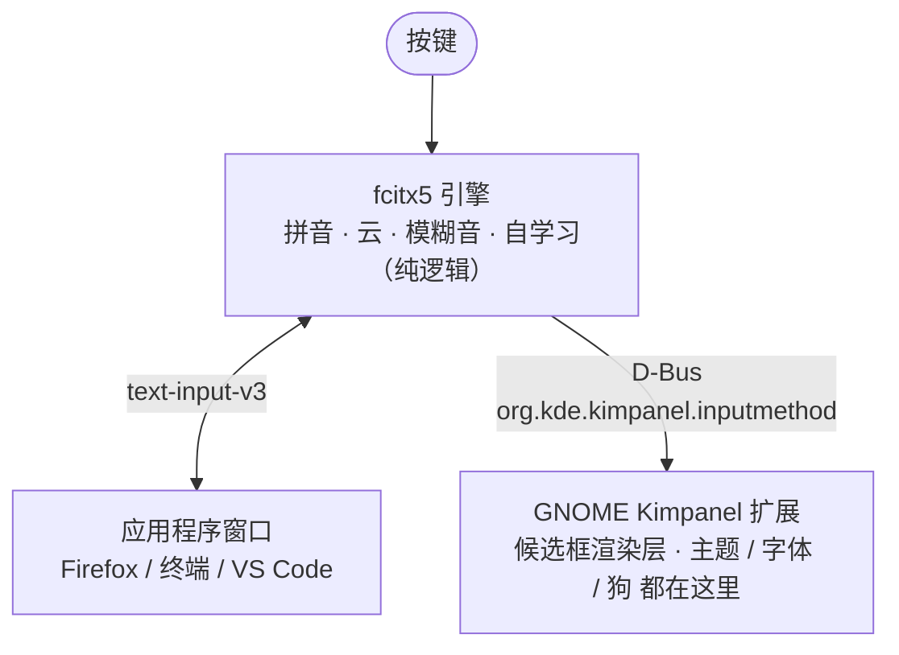
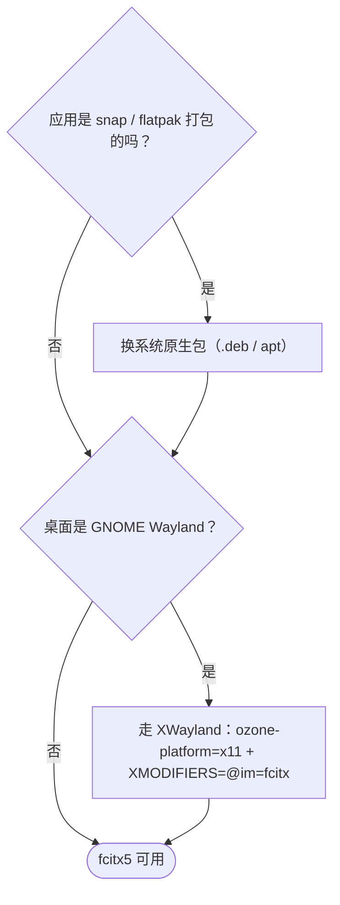
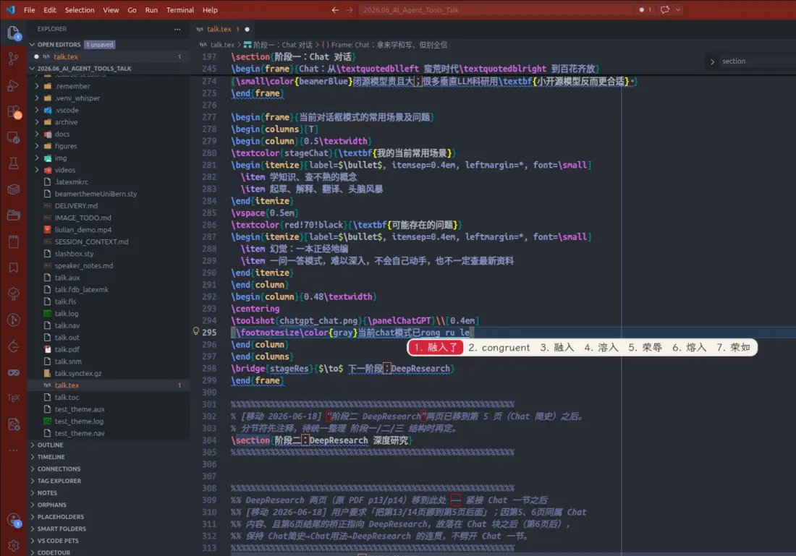

# Ubuntu 上把搜狗换成 fcitx5：云拼音、模糊音，外加一只跑动的狗

作者：jajupmochi（人类） × Claude Code（Opus 4.7/4.8）

> 说明：这套配置是本文的人类作者（这时在伯尔尼大学工作）和 Claude（Claude Code，模型 Opus 4.7/4.8）一起做的。下文为了分清谁干了什么，**「作者」指人类**（拍板需求、定审美、踩坑判断），**「Claude」指 AI**（动手配置、写代码、画图）。

搜狗在 Wayland 下打不出字了，作者不想退回 Xorg，于是整套换成 fcitx5，过程中顺手做了点自己的东西。命令都能直接复制。

**完整代码**——fcitx5 配置、Kimpanel 主题、跑动的狗的帧图、`dog-design.zip`——都在配套仓库：<https://github.com/jajupmochi/ubuntu-fcitx5-pinyin>

---

## 给 AI Agent 的一段话

不想手敲的话，把下面这段交给 Claude Code 或任意能跑命令的 agent：

```text
你是我的 Linux 桌面配置助手，环境 Ubuntu 24.04 + GNOME，Xorg 或 Wayland（fcitx5 两者都支持）。
请按这篇教程复刻整套 fcitx5 配置（云拼音、模糊音、自学习、Kimpanel
面板、主题、字体、云加载时跑动的狗）。

先拿到教程全文：
- 本博客是客户端渲染的 SPA：直接抓阅读地址
  https://jajupmochi.github.io/blog.html?post=ubuntu-fcitx5-pinyin&lang=zh
  只会拿到页面外壳，不是正文。要拿正文，请直接抓原始 Markdown：
  https://jajupmochi.github.io/blog-posts/ubuntu-fcitx5-pinyin/zh.md
  （英文版换成 .../en.md），把正文读进来；
- 两个都抓不到（反爬 / 403 / 离线），就让我把本文从下一节起到结尾复制给你。

然后：
1. 先探测环境：whoami、echo $XDG_SESSION_TYPE（x11/wayland）、
   localectl status（键盘布局）、gnome-shell --version、
   dpkg -l | grep -E 'fcitx|ibus'，结果讲给我听；并留意「一·五」节
   （Xorg 还是 Wayland）和 5.1 节（键盘布局坑）；
2. 按章节顺序执行，命令里的用户名/路径换成我机器上的真实值；
3. 改 ~/.config/fcitx5 下任何文件前先 pkill -x fcitx5，改完再后台拉起，
   否则 fcitx5 退出时会用旧配置把改动覆盖掉；
4. 改 GNOME 扩展 JS（panel.js）后提醒我：必须注销重登才生效，
   disable/enable 没用；
5. 每做完一节停下来让我确认。
```

---

## 目录

- [一、为什么换 fcitx5](#一为什么换-fcitx5)
- [一·五、Xorg 还是 Wayland：检查、取舍与切换](#一五xorg-还是-wayland检查取舍与切换)
- [二、最终效果](#二最终效果)
- [三、两层架构](#三两层架构)
- [四、装 fcitx5 和中文支持](#四装-fcitx5-和中文支持)
- [五、调拼音引擎](#五调拼音引擎)
  - [5.1 配置会被回写（先读）](#51-配置会被回写先读)
  - [5.2 显示拼音预编辑](#52-显示拼音预编辑)
  - [5.3 云拼音（百度）](#53-云拼音百度)
  - [5.4 模糊音](#54-模糊音)
  - [5.5 自学习](#55-自学习)
  - [5.6 键位](#56-键位)
- [六、消除候选框闪烁：Kimpanel 扩展](#六消除候选框闪烁kimpanel-扩展)
- [七、自定义部分](#七自定义部分)
  - [7.1 配色：伯尔尼大学红](#71-配色伯尔尼大学红)
  - [7.2 字体：霞鹜文楷](#72-字体霞鹜文楷)
  - [7.3 云加载动画：跑动的咪咪](#73-云加载动画跑动的咪咪)
  - [7.4 Lua 小工具](#74-lua-小工具)
- [八、自己改：所有可配置项](#八自己改所有可配置项)
- [九、踩坑速查](#九踩坑速查)
- [九·五、应用层的坑：snap 版 VS Code 连不上 fcitx5](#九五应用层的坑snap-版-vs-code-连不上-fcitx5)
- [十、资源下载](#十资源下载)
- [十一、附录：词库（向搜狗看齐）](#十一附录词库向搜狗看齐)
- [十二、附录：完整命令与脚本](#十二附录完整命令与脚本)

---

## 一、为什么换 fcitx5

作者一直用搜狗。某天开机后状态栏图标还在，但一个字打不出来。重装、清配置都没用——问题不在搜狗，在于刚把桌面从 Xorg 换成了 Wayland。

退回 Xorg 能让搜狗复活，但作者用下来觉得整个桌面明显变迟钝。几个每天都遇到、对比明显的地方（纯个人体感，Wayland 都更顺）：

- 文件管理器开几千文件的大目录：Xorg 下缩略图刷新卡顿、滚动撕裂；Wayland 丝滑。
- 浏览器冷启动、拖标签、切工作区：Wayland 更快更稳，Xorg 偶尔掉帧。
- VS Code 这类 Electron 应用滚大文件、分屏重绘：Xorg 有拖影，Wayland 跟手。
- 多屏混合 DPI 缩放：Xorg 分数缩放糊、跨屏拖窗口闪；Wayland 每屏独立 DPI、平滑。这条对作者几乎是决定性的。

所以作者的选择是留在 Wayland、放弃搜狗。不用 ibus（拼音体验差一截），改用 fcitx5：插件齐全、对 Wayland 的 `text-input-v3` 支持好。参考 [Arch Wiki: Fcitx5](https://wiki.archlinux.org/title/Fcitx5)。

方案：**fcitx5 引擎 + 自带拼音 + GNOME 的 Kimpanel 扩展画候选框**。为什么候选框要单独拎出来，见第六节。

## 一·五、Xorg 还是 Wayland：检查、取舍与切换

整套配置在 **Xorg 和 Wayland 上都能用**——fcitx5 两者都支持。作者当时在 Wayland；如果你在别的机器上复刻，先确认自己在哪个上面，因为有两处差异取决于显示服务器。

```bash
echo "$XDG_SESSION_TYPE"                 # x11 = Xorg，wayland = Wayland
loginctl show-session "$(loginctl | awk 'NR==2{print $1}')" -p Type
```

**两者的差异：**

- **第六节（闪烁）只在 Wayland 上存在。** 候选框闪烁来自 classicui 在 GNOME Wayland 下用 `xdg_popup`。在 **Xorg 上没有这种闪烁**，所以那边 Kimpanel 扩展是*可选*的——只为主题/字体/狗（六、七节）才装，不是为修闪烁。
- **环境变量（第四节）在 Xorg 上更重要。** 原生 Wayland 应用走 `text-input-v3`，不设 `GTK_IM_MODULE` 也行；但在 **Xorg** 上每个 GTK/Qt/X11 应用都靠那三个变量，而 `im-config -n fcitx5`（写 `~/.xinputrc`）是那边的标准切换方式。

**你为什么可能被卡在 Xorg。** Ubuntu 的 GDM 在检测到 NVIDIA 闭源驱动时会禁用 Wayland，于是 `/etc/gdm3/custom.conf` 里留下一行：

```bash
grep -n WaylandEnable /etc/gdm3/custom.conf   # WaylandEnable=false → Wayland 被关掉了
```

**取舍（方便你自己决定，这是第一节作者体感的提炼）：**

- *选 Wayland：* 文件管理器/浏览器/VS Code 更顺，以及——几乎决定性的——多屏混合 DPI 下正确的**每屏分数缩放**。fcitx5 在 Wayland 上通过 `text-input-v3` 支持良好。
- *不选 Wayland：* 部分**录屏/远程桌面**工具和 **X11 自动化**（xdotool、autokey、x11vnc、老版 Zoom/TeamViewer 共享）行为不同或要走 portal。**Intel/AMD** 核显切过去风险低；**NVIDIA** 可能更不稳（驱动 545+/显式同步后改善很多，但要测）。提示：若你是 Intel+NVIDIA 混合、且 NVIDIA 闭源驱动其实没加载，那当前是 Intel 在驱动，切 Wayland 很安全。
- *搜狗（fcitx4）* 基本只在 Xorg 上能用——但本文已用 fcitx5 把它替换掉，而 fcitx5 两边都行，所以这条不再是留在 Xorg 的理由。

**从 Xorg 切到 Wayland**（在 GDM 里重新开启，再到登录界面选会话）。需要 root：

```bash
sudo cp /etc/gdm3/custom.conf /etc/gdm3/custom.conf.bak     # 备份，可回退
sudo sed -i 's/^WaylandEnable=false/#WaylandEnable=false/' /etc/gdm3/custom.conf
# 然后重启。在 GDM 登录界面点右下角齿轮 ⚙，选 “Ubuntu”（Wayland），
# 不要选 “Ubuntu on Xorg”。
```

想退回：还原备份（`sudo cp /etc/gdm3/custom.conf.bak /etc/gdm3/custom.conf`），或在登录界面直接选 “Ubuntu on Xorg”。登录后用 `echo $XDG_SESSION_TYPE` 确认（期望 `wayland`）。

## 二、最终效果

平时：暖米白卡片、伯尔尼红药丸高亮、顶部一行实时拼音预编辑。


触发百度云拼音那一瞬间，第 2 候选位会蹦出一只跑动的中华田园犬——作者给它起名叫咪咪，棕黄毛、红项圈、挂着写「咪」字的小牌子：


单独看动画（8 帧、75ms 一帧、600ms 一循环）：


## 三、两层架构

配 fcitx5 容易卡在一个误解上：以为输入法是一个整体。在 GNOME Wayland 上它是两层，分清楚后每步操作都有归属。



- **引擎层 fcitx5**：决定「打什么」。配置在 `~/.config/fcitx5/`。
- **渲染层 Kimpanel 扩展**：决定「显示成什么样」。文件在 `~/.local/share/gnome-shell/extensions/kimpanel@kde.org/`。

不用 fcitx5 自带的 classicui 渲染，因为它在 GNOME Wayland 下会闪（见第六节）。

> 环境：Ubuntu 24.04 / GNOME 46 / Wayland，fcitx5 5.1.7。

## 四、装 fcitx5 和中文支持

核心三件套：

```bash
sudo apt update
sudo apt install -y fcitx5 fcitx5-chinese-addons fcitx5-config-qt fcitx5-module-lua fonts-lxgw-wenkai
```

`fcitx5-chinese-addons` 最关键，拼音引擎、云拼音、双拼、拆字都在里面。需要 RIME 或码表再加 `fcitx5-rime fcitx5-table-extra`（可选，本文用自带拼音）。

其中两个包容易漏：**`fcitx5-module-lua`** 是单独的包，7.4 节的 Lua 工具要靠它——不装的话 `custom.lua` 会静默失效。**`fonts-lxgw-wenkai`** 直接从 apt 装面板字体，比 7.2 节手动下载省事（仅 Debian/Ubuntu）。

环境变量，写到 `~/.config/environment.d/`（GNOME 在 Wayland 通过 systemd 用户环境读它）：

```bash
mkdir -p ~/.config/environment.d
cat > ~/.config/environment.d/fcitx.conf <<'EOF'
GTK_IM_MODULE=fcitx
QT_IM_MODULE=fcitx
XMODIFIERS=@im=fcitx
EOF
im-config -n fcitx5
```

注意：GNOME 原生 Wayland 应用走 `text-input-v3`，不设 `GTK_IM_MODULE` 也能用 fcitx5；上面三个变量主要给 XWayland、Qt、Electron 应用兜底。不设的话部分软件打不了中文。

在 **Xorg** 上，这三个变量对*所有* GTK/Qt/X11 应用都重要（不只是 XWayland），而 `im-config -n fcitx5`——它会往 `~/.xinputrc` 写入 `run_im fcitx5`——是那边的标准切换方式（见一·五）。

设开机自启，然后**注销重登**：

```bash
cp /usr/share/applications/org.fcitx.Fcitx5.desktop ~/.config/autostart/ 2>/dev/null || true
```

验证：

```bash
pgrep -a fcitx5
echo "$GTK_IM_MODULE / $QT_IM_MODULE / $XMODIFIERS"   # 期望 fcitx / fcitx / @im=fcitx
```

`Ctrl+Space` 切到拼音能打字即可。此时样子素、可能闪，继续。

## 五、调拼音引擎

以下都在 `~/.config/fcitx5/conf/` 改文本。完整文件在 [`resources/fcitx5/`](https://github.com/jajupmochi/ubuntu-fcitx5-pinyin/tree/main/resources/fcitx5)，可直接覆盖（先读 5.1）。

### 5.1 配置会被回写（先读）

fcitx5 退出时会用内存里的配置整个重写 `conf/*.conf`。所以**在它运行时手改文件，改动会在下次重启被覆盖**。作者在这上面卡了快一个小时。

正确顺序：

```bash
pkill -x fcitx5; sleep 1.5
# 改文件 / 覆盖文件
setsid fcitx5 -d </dev/null &>/dev/null &
```

下文每处手改都默认在这个框架里。用 `fcitx5-configtool` 图形界面改则不受此限。

> **抄配置文件前先知道两件事：**
>
> **(a) ⚠️ 键盘布局——要和你的物理键盘一致。** 仓库里的 `profile` 把布局**写死成 US**（`Default Layout=us`、输入法 `keyboard-us`）。如果你的键盘不是 US（法语 AZERTY、德语、瑞士…），fcitx5 接管后会强制成 US QWERTY，键位和你打的对不上。先用 `localectl status`（看 *X11 Layout* 那行）查出真实布局，再到 `~/.config/fcitx5/profile` 把 `Default Layout=<xkb>` 和输入法名 `keyboard-<xkb>` 改对，并同步 GNOME。以法语为例：
>
> ```bash
> sed -i 's/^Default Layout=us/Default Layout=fr/' ~/.config/fcitx5/profile
> sed -i 's/^Name=keyboard-us/Name=keyboard-fr/'   ~/.config/fcitx5/profile
> gsettings set org.gnome.desktop.input-sources sources "[('xkb','fr')]"
> ```
>
> **(b) 用「预置」绕开回写。** 对付上面的「退出回写」最省事的办法：在 fcitx5 **第一次运行之前**就把整套仓库 `resources/fcitx5/` 铺进 `~/.config/fcitx5/`——仓库的 `pinyin.conf` 带 `FirstRun=False`，首启不会重置；且仓库的 `profile` 已经把*拼音*放进了输入法组，于是连图形界面里「添加输入法」那步都省了。（完整部署命令见 12.3。）

### 5.2 显示拼音预编辑

像搜狗那样在候选框顶部显示已敲的完整拼音。`~/.config/fcitx5/conf/pinyin.conf`：

```ini
PinyinInPreedit=True
PreeditMode="Composing pinyin"
PageSize=7
```

`~/.config/fcitx5/config` 里关掉「把预编辑嵌进应用」，让预编辑统一显示在浮动候选框上：

```ini
[Behavior]
PreeditEnabledByDefault=False
```

### 5.3 云拼音（百度）

本地词库打不出的生僻词、人名、新词，从云端取。`pinyin.conf`：

```ini
CloudPinyinEnabled=True
CloudPinyinIndex=2          # 云候选插到第 2 位
CloudPinyinAnimation=True   # 云加载动画占位（后面咪咪的入口）
```

后端在 `cloudpinyin.conf`，整个就两行：

```ini
MinimumPinyinLength=4
Backend=Baidu               # 可选 Baidu | Google | GoogleCN
```

注意：fcitx5 没有搜狗后端，国内网络下百度最稳。`CloudPinyinIndex=2` 决定了狗固定出现在第 2 候选位——对照第二张效果图。

### 5.4 模糊音

让 `in` 匹配 `ing`、`s` 匹配 `sh` 等。`pinyin.conf` 的 `[Fuzzy]` 段，作者开的这组可直接抄：

```ini
[Fuzzy]
VE_UE=True
NG_GN=True
Inner=True
InnerShort=True
PartialFinal=True
AN_ANG=True
EN_ENG=True
IN_ING=True
IAN_IANG=True
UAN_UANG=True
Z_ZH=True
C_CH=True
S_SH=True
L_N=True
F_H=True
V_U=False      # 这两个开了噪声大，关
U_OU=False
```

### 5.5 自学习

不用配，fcitx5 拼音默认就自学习，记到：

```
~/.local/share/fcitx5/pinyin/user.dict
~/.local/share/fcitx5/pinyin/user.history
```

打得越多排序越懂你。想清空记忆就删这两个文件。联想也顺手开上：

```ini
Prediction=True
PredictionSize=10
```

注意：fcitx5 不支持空格键确认联想词（空格永远确认当前高亮），联想词只能数字键选。这是引擎设计，没有开关。

### 5.6 键位

作者的习惯：方向键 ← → 留给预编辑里移动光标，选词用 `Tab` / `Shift+Tab` 翻、数字键定。`~/.config/fcitx5/config`：

```ini
[Hotkey/PrevCandidate]
0=Shift+Tab

[Hotkey/NextCandidate]
0=Tab
```

不要把 `Left`/`Right` 绑到候选选择，留空它们方向键才回归光标移动。

## 六、消除候选框闪烁：Kimpanel 扩展

候选框时不时闪一下，尤其出现云加载转圈符时。根因是 fcitx5 自带的 classicui 在 GNOME Wayland 下用 `xdg_popup` 画浮动窗口，GNOME 合成器对这种输入法 popup 不友好，每次刷新可能重建窗口。

解法不是修 classicui，而是绕过它：让 GNOME 用 Kimpanel 扩展画候选框。fcitx5 通过 D-Bus 把候选告诉扩展，扩展用 GNOME 原生 St 工具画，不建额外系统窗口，闪烁消失。附带好处：主题、字体、塞只狗都变得可控。

从扩展商店装「Input Method Panel (Kimpanel)」（<https://extensions.gnome.org/extension/261/kimpanel/>，UUID `kimpanel@kde.org`），装完**注销重登**。改好的文件在 [`resources/kimpanel/`](https://github.com/jajupmochi/ubuntu-fcitx5-pinyin/tree/main/resources/kimpanel)。

启用：

```bash
gsettings set org.gnome.shell disable-user-extensions false
gnome-extensions enable kimpanel@kde.org
gnome-extensions info kimpanel@kde.org | grep State   # 期望 ACTIVE
```

注意：作者在这卡过——`disable-user-extensions` 若为 `true` 会静默禁用所有用户扩展，扩展状态一直停在 `INITIALIZED`。必须先设回 `false`。

**不用浏览器装（可脚本化 / 对 AI 友好）。** 不走商店，按 UUID 拿到对应 GNOME Shell 版本的扩展，装上，再覆盖仓库文件：

```bash
VER=$(gnome-shell --version | grep -oE '[0-9]+' | head -1)
url=$(curl -sL "https://extensions.gnome.org/extension-info/?uuid=kimpanel@kde.org&shell_version=$VER" \
      | python3 -c 'import sys,json;print("https://extensions.gnome.org"+json.load(sys.stdin)["download_url"])')
curl -sL "$url" -o /tmp/kimpanel.zip
gnome-extensions install --force /tmp/kimpanel.zip
# 然后把 resources/kimpanel/{panel.js,stylesheet.css} 和 dog/ 覆盖到已装扩展上（见 12.4）
```

坑：刚装好的扩展，**正在运行**的 shell 还不认识它，所以 `gnome-extensions enable` 可能没反应、`info` 也查不到，直到你重登。可以先把 UUID 写进启用列表再注销重登（完整片段见 12.4）。

## 七、自定义部分

以下是作者和 Claude 自己做的东西，改的都是 Kimpanel 扩展目录下的 `stylesheet.css`（样子）和 `panel.js`（行为）。

### 7.1 配色：伯尔尼大学红

作者这时在伯尔尼大学，于是把主色定成伯尔尼大学品牌红。官方色板见 [CTU-Bern/unibeCols](https://github.com/CTU-Bern/unibeCols)，`unibeRed` = `#E4003C`。

配色分配（`stylesheet.css`，可直接抄）：

```css
.popup-menu-content.kimpanel-popup-content {
  background-color: #f6f2ec;     /* 暖米白卡片 */
  border: 1px solid #e4ded6;
  border-radius: 12px;
  padding: 1px 2px;              /* 高亮周围白边，越小越紧凑 */
  color: #33312e;
}
.kimpanel-candidate-item {
  border-radius: 8px;
  padding: 0.1em 0.46em;
  margin: 0;
  transition-duration: 0ms;
}
.kimpanel-candidate-item:hover { background-color: rgba(215, 38, 61, 0.12); }
.kimpanel-popup-content .kimpanel-candidate-item:active {
  background-color: #d7263d;     /* 当前候选：伯尔尼红药丸 */
  color: #ffffff;
}
```

注意：严格的官方红 `#E4003C` 饱和度高，整块盯久了累眼。所以药丸用了压柔的 `#d7263d`，官方红留在 classicui 后备主题里——护眼和品牌之间的折中。

### 7.2 字体：霞鹜文楷

作者想要点书卷气，用了开源手写体霞鹜文楷（LXGW WenKai）。装字体：

```bash
mkdir -p ~/.local/share/fonts
# 从 https://github.com/lxgw/LxgwWenKai/releases 下载 LXGWWenKai-Regular.ttf
mv ~/Downloads/LXGWWenKai-Regular.ttf ~/.local/share/fonts/
fc-cache -f
fc-list | grep -i wenkai
```

在 Debian/Ubuntu 上可以完全跳过手动下载——字体有打包：`sudo apt install fonts-lxgw-wenkai`（已在上面第四节的安装命令里）。

注意：Kimpanel 字体不能用 CSS 设——St 忽略 CSS 里的 `!important`，扩展会用一段从 gsetting 读出的内联样式盖过 CSS。所以走 gsetting，且**实时生效不用重登**：

```bash
gsettings --schemadir ~/.local/share/gnome-shell/extensions/kimpanel@kde.org/schemas \
  set org.gnome.shell.extensions.kimpanel font 'LXGW WenKai 14'
```

`'字族 字号'` 格式，换字号改数字，换回系统默认设成 `'Sans 14'`。

Claude 在这调字号怎么都不对，最后定位到 `panel.js` 的 `updateFont()` 硬编码追加了 `; font-size: 16pt;`，盖掉了 gsetting。删掉那段，交给 gsetting：

```javascript
updateFont(textStyle) {
    this.text_style = textStyle;          // 不要再硬编码字号
    this.auxText.set_style(this.text_style);
    this.preeditText.set_style(this.text_style);
    let lookupTable = this.lookupTableLayout.get_children();
    for (let i = 0; i < lookupTable.length; i++) lookupTable[i].set_style(this.text_style);
}
```

注意：CSS 改样子实时生效，但改 `panel.js` 必须注销重登——GNOME 缓存了扩展的 ESM 模块，`disable/enable` 不重新加载。

### 7.3 云加载动画：跑动的咪咪

`CloudPinyinAnimation=True` 开启后，fcitx5 等云端返回时会在候选位循环显示四个转圈字符 `◐ ◓ ◑ ◒`。这个位置本来就是「去远处取数据」的语义，作者想换成一只跑去取数据的狗。

**资源怎么来的（人类定方向、Claude 出图）。** 作者提的要求很挑：必须同一只狗的连续奔跑帧，不要两个图标交替（像两只狗打架），不要加爪印云朵 emoji（整体会变得像一朵云），得是中华田园犬、红项圈、挂「咪咪」牌。落地分三步：

1. **Claude Code 出初稿**：用 PIL/Pillow 写脚本，靠椭圆、多边形、线条拼出 4 帧侧面狗。能跑，但脸尖、耳朵像狐狸、脖子和身体分离。早期版：

   

2. **作者逐轮校准、Claude 改脚本**：圆脸颊、收圆耳朵、连上脖子、项圈改成有透视的近侧弧、缩小名牌、削掉突出的屁股、缩小头……七八版。这版的参数化脚本在 [`resources/kimpanel/dog/draw_dog_handdrawn_reference.py`](https://github.com/jajupmochi/ubuntu-fcitx5-pinyin/blob/main/resources/kimpanel/dog/draw_dog_handdrawn_reference.py)。

3. **Claude Design 出定稿**：8 帧、160×120、透明、标准 gallop 步态，身后加扬尘。就是现在用的版本：

   

整套设计包（8 帧 + 说明 + CSS + 预览）打包在 [`resources/dog-design.zip`](https://github.com/jajupmochi/ubuntu-fcitx5-pinyin/raw/main/resources/dog-design.zip)。

**怎么动起来（Claude 实现，有个坑）。** 直觉是「字符映射」：把 `◐◓◑◒` 四个字符各映射一张图。但 fcitx5 只有 4 个转圈字符、节奏也由它定，最多放 4 帧、帧率不可控。定稿是 8 帧、要求 75ms 一帧。

正确做法是把动画和 fcitx5 字符脱钩：一旦在候选里探测到转圈字符（说明正在云加载），就自己起一个 GLib 75ms 定时器独立循环 `d0→d7`，字符消失就停。`panel.js` 核心（可直接抄）：

```javascript
import GLib from 'gi://GLib';   // 文件顶部

// _init() 里：this._dogTimer = 0; this._dogFrame = 0; this._dogIndex = -1;

// setLookupTable() 遍历候选，探测转圈字符所在格：
const _spin = {'◐':1, '◓':1, '◑':1, '◒':1};
let dogIdx = -1;
for (let i = 0; i < lookupTable.length; i++) {
    let _t = table[i];
    if (_spin[_t]) {
        dogIdx = i;
        lookupTable[i].text = '';                       // 清空文字，由 _paintDog 贴图
    } else {
        lookupTable[i].remove_style_class_name('kimpanel-dog');
        for (let _k = 0; _k < 8; _k++)
            lookupTable[i].remove_style_class_name('kimpanel-dog-' + _k);
        lookupTable[i].text = label[i] + _t;
    }
}
this._setDog(dogIdx);

_setDog(idx) {
    this._dogIndex = idx;
    if (idx < 0) { this._stopDog(); return; }
    let item = this.lookupTableLayout.get_children()[idx];
    if (!item) { this._stopDog(); return; }
    item.text = '';
    item.add_style_class_name('kimpanel-dog');
    this._paintDog();
    if (!this._dogTimer) {
        this._dogTimer = GLib.timeout_add(GLib.PRIORITY_DEFAULT, 75, () => {
            this._dogFrame = (this._dogFrame + 1) % 8;
            this._paintDog();
            return GLib.SOURCE_CONTINUE;
        });
    }
}
_paintDog() {
    let item = this.lookupTableLayout.get_children()[this._dogIndex];
    if (!item) { this._stopDog(); return; }
    for (let k = 0; k < 8; k++) item.remove_style_class_name('kimpanel-dog-' + k);
    item.add_style_class_name('kimpanel-dog-' + this._dogFrame);
}
_stopDog() {
    if (this._dogTimer) { GLib.source_remove(this._dogTimer); this._dogTimer = 0; }
    this._dogIndex = -1;
}
```

`destroy()` 里记得调一次 `this._stopDog()` 防止泄漏。完整文件见 [`resources/kimpanel/panel.js`](https://github.com/jajupmochi/ubuntu-fcitx5-pinyin/blob/main/resources/kimpanel/panel.js)。

8 张 PNG 命名 `d0.png`…`d7.png` 放进扩展 `dog/` 目录，`stylesheet.css`：

```css
.kimpanel-dog {
  width: 44px; height: 32px;
  background-repeat: no-repeat;
  background-size: contain;
  background-position: center;
}
.kimpanel-dog-0 { background-image: url("dog/d0.png"); }
/* …d1 到 d7 同理… */
.kimpanel-dog-7 { background-image: url("dog/d7.png"); }
```

放好图、改完两个文件后**注销重登**，打一串长拼音（如 `woshizhongguoren`）触发云查词，狗就跑起来了。

### 7.4 Lua 小工具

顺手用 fcitx5 的 Lua 能力加了计算器和星期。`~/.local/share/fcitx5/lua/imeapi/extensions/custom.lua`（完整在 [`resources/fcitx5/lua/custom.lua`](https://github.com/jajupmochi/ubuntu-fcitx5-pinyin/blob/main/resources/fcitx5/lua/custom.lua)）：

```lua
-- 中文模式下：js(1+2)*3 -> 9 ；xq -> 星期X
ime.register_command("js", "custom_calc",    "计算器", "none",  "输入算式")
ime.register_command("xq", "custom_weekday", "星期",   "alpha", "今天星期几")
```

用法：中文模式按分号 `;` 触发，再打 `js(1+2)*3` 或 `xq`。快捷短语（邮箱、颜文字）放 `~/.local/share/fcitx5/data/quickphrase.d/custom.mb`，格式 `缩写<Tab>展开`。改完照例先杀 fcitx5 再起。

## 八、自己改：所有可配置项

这套东西的价值是「换成你的」。下面先列**所有能自己改的项**，再说怎么改。每项都标了改哪个文件、是否要重登。写得尽量让 AI agent 能照做。

| 想改的 | 改哪里 | 实时生效？ |
|---|---|---|
| 卡片背景色 | `stylesheet.css` `.kimpanel-popup-content` 的 `background-color` | 是（CSS） |
| 高亮药丸色 / 品牌色 | `stylesheet.css` `:active` 的 `background-color` + `:hover` 的 `rgba(...)` | 是 |
| 圆角 / 白边 | `stylesheet.css` 的 `border-radius` / `padding` | 是 |
| 字体 + 字号 | gsetting `org.gnome.shell.extensions.kimpanel font` | 是 |
| 候选词数 | `pinyin.conf` `PageSize` | 否（重启 fcitx5） |
| 模糊音组合 | `pinyin.conf` `[Fuzzy]` 各布尔 | 否 |
| 云后端 / 触发长度 | `cloudpinyin.conf` `Backend` / `MinimumPinyinLength` | 否 |
| 云候选位置 | `pinyin.conf` `CloudPinyinIndex` | 否 |
| 选词 / 翻页键 | `config` `[Hotkey/*Candidate]` `[*Page]` | 否 |
| 狗（造型 / 帧数 / 大小 / 速度） | `dog/d*.png` + `stylesheet.css` `.kimpanel-dog*` + `panel.js` `% N` 和 75ms | 改图/CSS 实时；改 `panel.js` 要重登 |
| Lua 工具 / 快捷短语 | `lua/.../custom.lua` / `quickphrase.d/custom.mb` | 否 |

**给 AI agent 的照做清单：**

1. **换品牌色（最简单，实时）**：拿到你学校/公司的主色 hex（官网 Corporate Design 页，或 [brandcolors.net](https://brandcolors.net/)），在 `stylesheet.css` 里把 `#d7263d` 和 `rgba(215,38,61,0.12)` 全局替换成你的色值（后者是主色的 12% 透明版）。可选连背景 `#f6f2ec` 一起换。保存即生效，反复调到满意。

2. **换字体/字号（实时）**：装好字体后跑那条 `gsettings ... font '你的字族 字号'`。务必确认 `panel.js` 的 `updateFont()` 没有硬编码 `font-size`（见 7.2），否则 gsetting 被盖。

3. **换狗（或别的动物）**：
   - 想代码画：参考 [`draw_dog_handdrawn_reference.py`](https://github.com/jajupmochi/ubuntu-fcitx5-pinyin/blob/main/resources/kimpanel/dog/draw_dog_handdrawn_reference.py)，用 PIL 把动物拆成椭圆/线条/多边形，逐帧微调腿尾坐标，`SS=6` 超采样后 `LANCZOS` 缩小。
   - 想 AI 出图：给文生图模型这样的提示词 ——「画一只侧面奔跑的 X，卡通扁平风，标准 gallop 8 帧序列，每帧 160×120、透明 PNG、统一朝左、相邻帧腿部平滑过渡，命名 d0.png 到 d7.png」。
   - 拿到 N 帧后：放进 `dog/`，CSS 留 N 个 `.kimpanel-dog-i`，把 `panel.js` 里两处 `% 8` 改成 `% N`。帧数不必是 8，3 帧也行。改完重登。

4. **调模糊音/云/键位**：按第五节改对应 `conf`，记得「先杀 fcitx5 再起」（5.1）。

## 九、踩坑速查

| 现象 | 原因 | 解法 |
|---|---|---|
| 改 conf 重启后变回去 | fcitx5 退出回写配置 | 先 `pkill -x fcitx5` 再改（5.1） |
| 部分软件打不了中文 | 环境变量没配全 | `environment.d/fcitx.conf` 三变量 + 重登（四） |
| 候选框闪烁 | classicui 的 xdg_popup | 改用 Kimpanel（六） |
| Kimpanel 停在 INITIALIZED | `disable-user-extensions=true` | 设回 `false`（六） |
| 字号调不动 | `panel.js` 硬编码 16pt | 删掉，交给 gsetting（7.2） |
| 字体改了没反应 | St 忽略 CSS 字体 | 用 gsetting，不用 CSS（7.2） |
| 改 panel.js / 狗没生效 | GNOME 缓存扩展 JS | 注销重登，`disable/enable` 无效 |
| 想用搜狗云 | fcitx5 没有搜狗后端 | 用百度（5.3） |
| 键位打出来字母不对 | `profile` 强制了 `us` 布局 | 把 `Default Layout`/`keyboard-XX` 改成你真实的布局（5.1） |
| `js`/`xq`（Lua）没反应 | 没装 `fcitx5-module-lua` | `sudo apt install fcitx5-module-lua`（四） |
| 刚启动 `fcitx5-remote` 报 “Failed to get reply” | 还在加载大词库 | 正常，等几秒再试（十一） |
| 候选不如搜狗 | 只加载了默认词库 | 导入词库（附录十一） |
| VS Code（snap）打不出中文 | snap 自带运行时没 fcitx 桥；GNOME Wayland 原生 text-input 只认 ibus | 换官方 .deb，走 XWayland（九·五） |

## 九·五、应用层的坑：snap 版 VS Code 连不上 fcitx5

前面几节配完，作者以为全系统都能打中文了。结果在 **VS Code 里偏偏打不出**——浏览器、终端、文件管理器都正常，唯独它。根因不在 fcitx5，而在**这个应用是怎么打包的**，所以单拎一节出来。（作者后来在新机器上用 VS Code 时又踩到，索性补进来。）

**症状。** VS Code 里敲拼音直接出英文字母，候选框不弹；按惯用的中英切换键也没反应。

**先排查三件事**，判断是 fcitx5 的问题还是这个应用的问题：

```bash
echo "$XDG_SESSION_TYPE"                              # 这台是 wayland
echo "$GTK_IM_MODULE / $QT_IM_MODULE / $XMODIFIERS"   # fcitx / fcitx / @im=fcitx，系统层没问题
ls -l "$(which code)"                                 # /snap/bin/code -> ... 说明是 snap 版
```

别的程序能打、环境变量也对，就说明 fcitx5 没毛病，是 VS Code 这个进程拿不到输入法。

**根因（两层叠加）：**

- **snap 自带运行时，没有 fcitx 的输入法桥。** snap 版 VS Code 把一整套库捆在沙箱里，Chromium/Electron 接输入法靠的是系统的 fcitx GTK 桥接模块（`im-fcitx5.so`），snap 里既没打包、又因路径隔离加载不到系统那份。所以你把 `GTK_IM_MODULE=fcitx` 设得再对，它内部也用不上。
- **GNOME Wayland 的原生 text-input 只认 ibus。** 就算绕过 snap，GNOME 的 `text-input-v3` 在合成器侧只接自带的 ibus，**不转给 fcitx5**（这点和 KDE 不同）。所以在 GNOME 上，fcitx5 给应用喂字得走 **XWayland 通道**（X11 应用用 `XMODIFIERS=@im=fcitx`），而不是原生 Wayland。



**解法：snap 版换微软官方 `.deb` 版。** 作者试过给 snap 版强行传 `--ozone-platform=x11` 并带上输入法环境变量，仍然不行——snap 的隔离是死结。换成 deb 版后，默认就走 XWayland、自动接上系统 fcitx5，**不需要任何启动参数**。设置和扩展都在 `~/.config/Code`、`~/.vscode`，两版共用，换过去自动继承。完整命令见 12.8。

换完直接 `code` 启动，点进编辑器敲拼音，候选框就正常弹出了：



**换源时真踩到的两个坑：**

- **apt 源那一行必须是单行。** 往 `/etc/apt/sources.list.d/vscode.list` 写 `deb [...] https://...` 时，如果在 `]` 和 URL 之间断了行，apt 会把它当成非法的跨行条目，`apt update` 直接报错。复制时别手动换行。
- **不相干的坏源会顺带搞砸安装。** 作者机器上有条早先加的第三方源失效了（`apt update` 报 “no longer has a Release file”），它让 `apt-get update` 返回非零，于是 `update && install` 的 `&&` 链被中断、`code` 没装上。`apt-cache policy code` 能看到微软源其实已经抓到包，直接 `apt-get install -y code` 即可；坏源单独禁用：`sudo sed -i 's/^deb/#deb/' /etc/apt/sources.list.d/那个.list`。

**顺手修中英切换键。** 作者这台的 `~/.config/fcitx5/config` 里 `[Hotkey/TriggerKeys]` 不知何时被写成了怪组合 `Control+Shift+Control_L`（还混着日文 `Zenkaku_Hankaku`、韩文 `Hangul`），根本不触发——这也是「Ctrl+Shift 没反应」的一半原因。换回干净的 `Ctrl+Space`：

```ini
[Hotkey/TriggerKeys]
0=Control+space
```

改完 `fcitx5-remote -r` 重载即可（这处不必整段重启 fcitx5）。注意 `Ctrl+Space` 在 VS Code 里也是补全键，但 fcitx5 在 XWayland 下会全局抢先，多半切的是输入法；真冲突就把 VS Code 那个键解绑，或换 `Super+space`。

## 十、资源下载

以下内容都在配套仓库——可克隆，或在线浏览/下载任意单个文件：<https://github.com/jajupmochi/ubuntu-fcitx5-pinyin>

`resources/` 目录结构：

```
resources/
├── dog-design.zip               咪咪 8 帧定稿设计包
├── kimpanel/
│   ├── stylesheet.css           候选框主题（最终版）
│   ├── panel.js                 候选框行为（含定时器驱动的狗，最终版）
│   └── dog/ d0–d7.png + draw_dog_handdrawn_reference.py
└── fcitx5/
    ├── config  profile
    ├── conf/ pinyin.conf  cloudpinyin.conf  classicui.conf
    ├── lua/custom.lua
    └── quickphrase/custom.mb
```

外部资源：

- 霞鹜文楷：<https://github.com/lxgw/LxgwWenKai/releases>（OFL）
- Kimpanel 扩展：<https://extensions.gnome.org/extension/261/kimpanel/>
- 伯尔尼大学色板：<https://github.com/CTU-Bern/unibeCols>（`unibeRed` = `#E4003C`）
- fcitx5 文档：<https://wiki.archlinux.org/title/Fcitx5>

字体文件（25MB）因体积没随包，用上面链接自取。

咪咪没什么实用价值，纯粹是作者的小乐趣——等云端取词的空当瞄一眼它跑过去，挺解压。想换成别的动物见第八节。

---

## 十一、附录：词库（向搜狗看齐）

上面几节给你一套能用、好看的 fcitx5。它没做的是追平搜狗的*词汇量*——刚装好的 fcitx5 在生僻词、人名、行话上确实比搜狗弱。这一节就补这块。（作者在第二台机器上复刻时加的。）

**底层引擎是什么。** fcitx5 的拼音是 **libime**——n-gram 语言模型 + 词库 + 自学习（它写 `~/.local/share/fcitx5/pinyin/user.dict` 和 `user.history`，打得越多排序越懂你）。开箱只带默认词库（`/usr/share/libime/sc.dict`），这正是它比搜狗单薄的原因。候选排序 ≈ 语言模型的整句概率 × 词频 × 你自己的历史；百度云（5.3）在第 2 位补一个在线候选。

**能用搜狗的*云*吗？** 不能。fcitx5 的 cloudpinyin 只有 `Baidu | Google | GoogleCN`（老的 fcitx4 才有搜狗后端，fcitx5 砍了）。百度是国内最优，且已经开着。**但是**搜狗真正的强项是它的*词库*，而词库**可以导进来**——这就是本节剩下的内容。

**词库放哪。** 把任意 `*.dict` 丢进 `~/.local/share/fcitx5/pinyin/dictionaries/`（没有就建），fcitx5 会加载该目录所有 `.dict`。重载用 `fcitx5 -r`（或 `pkill -x fcitx5; setsid fcitx5 -d </dev/null &>/dev/null &`）。

> ⚠️ **别贪多。** 这些词库重叠很厉害（光 `zhwiki` 就已覆盖科学/技术/人名/地名）。堆太多会让生僻词挤到前面、候选变吵、内存上涨——下面整套约 74 MB 磁盘 → ~210 MB 内存。挑几个贴合你打字习惯的就好。以后删某个：`rm ~/.local/share/fcitx5/pinyin/dictionaries/foo.dict && fcitx5 -r`。

### 11.1 现成 `.dict`（下载即用）

| 词库 | 大小 | 内容 | 推荐度（开发/ML/学术用户） | 来源 |
|---|---|---|---|---|
| **zhwiki** | ~32 MB | 中文维基百科——术语、人名、地名、科学、技术 | ✅✅ 最值得装的一个 | [felixonmars/fcitx5-pinyin-zhwiki releases](https://github.com/felixonmars/fcitx5-pinyin-zhwiki/releases) |
| **肥猫百万词库** | ~30 MB | ~150 万通用高频词 | ✅ 极好的日常底座，和 zhwiki 互补 | [wuhgit/CustomPinyinDictionary releases](https://github.com/wuhgit/CustomPinyinDictionary/releases)，资源 `CustomPinyinDictionary_Fcitx.dict` |
| **zhwiktionary** | ~4.6 MB | 维基词典——词语/成语/释义 | ⚠️ 可选（与 zhwiki 重叠；写作多可加） | felixonmars（同一 release） |
| **zhwikisource** | ~3.9 MB | 维基文库——文言/古籍 | ❌ 除非写文言，跳过 | felixonmars（同一 release） |
| **web-slang** | ~8 KB | 网络流行语——搜狗官方「网络流行新词」的替代（后者转不了，见 11.2） | ✅ 很小，顺手装 | felixonmars（同一 release） |
| **moegirl 萌娘** | ~2.7 MB | ACG/动漫/游戏/二次元黑话 | ❌ 除非你二次元，跳过 | [outloudvi/mw2fcitx releases](https://github.com/outloudvi/mw2fcitx/releases)，`moegirl.dict` |

> 坑：felixonmars 的 release 带好几种资源——`zhwiki-*.dict`、`zhwiktionary-*.dict`、`web-slang-*.dict`，**外加**同名的 `*.dict.yaml` *源文件*。fcitx5 只要 `*.dict`；别下那个 55 MB 的 `.yaml`。

### 11.2 搜狗细胞词库——转换后导入

搜狗官网（<https://pinyin.sogou.com/dict/>）把用户词库分成 **12 大类**（大致数量）：城市信息 (167)、自然科学、社会科学 (76)、工程应用 (96)、农林渔畜 (127)、医学医药 (132)、电子游戏 (436)、艺术设计 (154)、生活百科 (389)、运动休闲 (367)、人文科学 (31)、娱乐休闲 (403)。

fcitx5 不能直接读 `.scel`，用 `fcitx5-chinese-addons-bin` / `libime-bin` 自带的两个工具转：

```bash
scel2org5 -o out.txt your.scel        # .scel → 文本（每行：词<TAB>拼音<TAB>0）
libime_pinyindict out.txt out.dict    # 文本 → libime 二进制
mv out.dict ~/.local/share/fcitx5/pinyin/dictionaries/ && fcitx5 -r
```

**装哪些（开发 / ML / 学术画像）：**

| 搜狗词库（示例 id） | 内容 | 推荐度 |
|---|---|---|
| 计算机专业词库 (403，约 7.6k)、实用IT词汇 (6239)、互联网 (2664)、编程术语 (1216) | IT / 编程 | ✅✅ 最有用 |
| 人工智能 (4070)、机器学习 (31696)、深度学习 (79782)、人工智能专业术语【官方】(72476)、算法与数据结构 (54015) | AI / ML | ✅✅ |
| 数学词汇大全【官方】(15202，约 1.6 万)、统计学名词 (8162) | 数学 / 统计 | ✅ |
| 物理词汇大全【官方】(15203，约 1.3 万) | 物理 | ✅（与 zhwiki 重叠） |
| 化学化工词汇大全【官方】(15205，约 1.3 万)、化学词汇大全 (148) | 化学 | ⚠️ 研究涉及分子时 |
| 生物词汇大全【官方】(15124，约 4.3 万)、生物信息学 (1375) | 生物 / 生信 | ⚠️ 相关才装 |
| 医学词汇大全【官方】(15125，约 9 万) | 医学 | ⚠️ 相关才装 |
| 中国地名大全 (1596) | 地名 | ⚠️ 可选（zhwiki 已含大量） |
| 电子游戏 / 娱乐明星 / 体育 / 法律财经 / 农林渔畜 | 各类 | ❌ |

> 找 ID：浏览分类页，或用这份索引 gist：<https://gist.github.com/leiless/55eddb489c53500373a5bc46c75afc4b>。某个词库的直链是 `https://pinyin.sogou.com/d/dict/download_cell.php?id=<ID>&name=<随便>`。

> ⭐ **格式坑（ECS vs DCS）——这个真花了时间。** 搜狗**官方自动生成**的词库（如「网络流行新词」id 4）现在是新版头 `40 15 00 00 45('E') 43 53 01`，`scel2org5` 拒绝它（`format error`；把那个字节改回 `44('D')` 能过头校验，但转出 **0 词**——词体格式也变了）。**用户上传**的词库还是经典 `44('D')` "DCS"，能正常转。转之前先判断：
>
> ```bash
> xxd -s4 -l1 your.scel    # 44 → 可转（DCS）；45 → 不可转（新 ECS）
> ```
>
> 所以官方那个流行语词库现在转不了——用 felixonmars 的 **web-slang**（11.1）顶替。12.5 的批量脚本会检查这个字节、自动跳过 ECS 的。

12.5 的脚本会批量下载一份精选 id 列表、跳过转不了的（ECS）、合并去重、编译成一个 `sogou.dict`（上面这组约 17.2 万词条）。

## 十二、附录：完整命令与脚本

全部集中在这——从上到下复制粘贴即可，或把整篇丢给 AI agent。需要管理员权限的步骤标了 **[root]**，由你自己来跑。

> 下面每个脚本在配套仓库里都有现成文件：[`resources/scripts/`](https://github.com/jajupmochi/ubuntu-fcitx5-pinyin/tree/main/resources/scripts)（附带运行顺序、以及哪些步骤需要 root 的 README）。克隆仓库，或单独下载某个。

### 12.1 需要管理员权限（root）的命令

下面这些是**仅有的**需要 `sudo` 的命令（没有免密 sudo 的机器用 `pkexec`——会弹 GNOME 密码框）。本附录其余都是用户级。

```bash
# [root] 装 fcitx5 + 中文插件 + Lua 模块 + 面板字体
sudo apt update
sudo apt install -y fcitx5 fcitx5-chinese-addons fcitx5-config-qt \
                    fcitx5-module-lua fonts-lxgw-wenkai

# [root]（仅当要切到 Wayland）在 GDM 重新开启 Wayland，并备份
sudo cp /etc/gdm3/custom.conf /etc/gdm3/custom.conf.bak
sudo sed -i 's/^WaylandEnable=false/#WaylandEnable=false/' /etc/gdm3/custom.conf

# [root]（可选）从 ibus 迁出？保留 ibus 核心——卸它会连带卸 Zoom 等依赖。
# 只删现在没用的 ibus 拼音引擎：
sudo apt remove -y ibus-libpinyin
```

### 12.2 一键安装脚本（`finish-install.sh`）

用 `bash finish-install.sh` 跑。它在装包那步调 `sudo`，以 root 运行也照样可用（例如 `pkexec` 下）：

```bash
#!/usr/bin/env bash
set -euo pipefail
SUDO=""; [ "$(id -u)" -ne 0 ] && SUDO="sudo"
export DEBIAN_FRONTEND=noninteractive
$SUDO apt-get update
$SUDO apt-get install -y fcitx5 fcitx5-chinese-addons fcitx5-config-qt \
                         fcitx5-module-lua fonts-lxgw-wenkai
im-config -n fcitx5                              # 切换输入法框架（写 ~/.xinputrc）
mkdir -p ~/.config/environment.d
cat > ~/.config/environment.d/fcitx.conf <<'EOF'
GTK_IM_MODULE=fcitx
QT_IM_MODULE=fcitx
XMODIFIERS=@im=fcitx
EOF
mkdir -p ~/.config/autostart
cp /usr/share/applications/org.fcitx.Fcitx5.desktop ~/.config/autostart/ 2>/dev/null || true
echo "完成。接着部署 ~/.config/fcitx5（12.3），然后注销重登。"
```

### 12.3 部署引擎配置（从配套仓库）

```bash
git clone --depth 1 https://github.com/jajupmochi/ubuntu-fcitx5-pinyin /tmp/u5
pkill -x fcitx5; sleep 1                          # 5.1：改前先停
mkdir -p ~/.config/fcitx5/conf \
         ~/.local/share/fcitx5/lua/imeapi/extensions \
         ~/.local/share/fcitx5/data/quickphrase.d
cp /tmp/u5/resources/fcitx5/profile               ~/.config/fcitx5/profile
cp /tmp/u5/resources/fcitx5/config                ~/.config/fcitx5/config
cp /tmp/u5/resources/fcitx5/conf/*.conf           ~/.config/fcitx5/conf/
cp /tmp/u5/resources/fcitx5/lua/custom.lua        ~/.local/share/fcitx5/lua/imeapi/extensions/
cp /tmp/u5/resources/fcitx5/quickphrase/custom.mb ~/.local/share/fcitx5/data/quickphrase.d/

# ⚠️ 设置你的键盘布局——仓库 profile 写死成 "us"
LAYOUT=fr                                         # 查你的：localectl status → X11 Layout
sed -i "s/^Default Layout=.*/Default Layout=$LAYOUT/" ~/.config/fcitx5/profile
sed -i "s/^Name=keyboard-.*/Name=keyboard-$LAYOUT/"   ~/.config/fcitx5/profile
gsettings set org.gnome.desktop.input-sources sources "[('xkb','$LAYOUT')]"

setsid fcitx5 -d </dev/null &>/dev/null &         # 重新拉起
```

### 12.4 Kimpanel 扩展（无浏览器）+ 主题 + 字体 + 狗

```bash
EXT=~/.local/share/gnome-shell/extensions/kimpanel@kde.org
VER=$(gnome-shell --version | grep -oE '[0-9]+' | head -1)
url=$(curl -sL "https://extensions.gnome.org/extension-info/?uuid=kimpanel@kde.org&shell_version=$VER" \
      | python3 -c 'import sys,json;print("https://extensions.gnome.org"+json.load(sys.stdin)["download_url"])')
curl -sL "$url" -o /tmp/kimpanel.zip && gnome-extensions install --force /tmp/kimpanel.zip
cp /tmp/u5/resources/kimpanel/panel.js       "$EXT/panel.js"
cp /tmp/u5/resources/kimpanel/stylesheet.css "$EXT/stylesheet.css"
mkdir -p "$EXT/dog"; cp /tmp/u5/resources/kimpanel/dog/d?.png "$EXT/dog/"
gsettings set org.gnome.shell disable-user-extensions false
gsettings --schemadir "$EXT/schemas" set org.gnome.shell.extensions.kimpanel font 'LXGW WenKai 14'
# 预置成下次登录自动启用（运行中的 shell 看不到新装的扩展）：
python3 - <<'PY'
import subprocess, ast
k, key = 'org.gnome.shell', 'enabled-extensions'
cur = ast.literal_eval(subprocess.check_output(['gsettings','get',k,key]).decode())
if 'kimpanel@kde.org' not in cur: cur.append('kimpanel@kde.org')
subprocess.run(['gsettings','set',k,key,'['+', '.join("'%s'"%x for x in cur)+']'])
PY
# 然后注销重登（panel.js 和新装扩展都需要 shell 重载）。
```

### 12.5 词库——装现成的 + 批量导入搜狗（见第十一节）

```bash
D=~/.local/share/fcitx5/pinyin/dictionaries; mkdir -p "$D"
T=/tmp/sg; mkdir -p "$T"; : > "$T/all.txt"

# 现成 .dict
curl -L -o "$D/zhwiki.dict" "$(curl -s https://api.github.com/repos/felixonmars/fcitx5-pinyin-zhwiki/releases/latest \
   | grep -oE 'https://[^\"]*zhwiki-[0-9]+\.dict' | head -1)"
curl -L -o "$D/feimao.dict" \
   https://github.com/wuhgit/CustomPinyinDictionary/releases/download/assets/CustomPinyinDictionary_Fcitx.dict

# 搜狗细胞词库——精选 id（IT/AI/数学/物理/化学/生物/医学/地名）；自动跳过 ECS 格式
for id in 4070 31696 79782 72476 54015 403 6239 2664 1216 15202 8162 15203 165 15205 148 15124 1375 12825 15125 1596; do
  curl -sL "https://pinyin.sogou.com/d/dict/download_cell.php?id=$id&name=d$id" -o "$T/$id.scel"
  [ "$(xxd -s4 -l1 "$T/$id.scel" | awk '{print $2}')" = "44" ] || { echo "跳过 $id（新 ECS 格式）"; continue; }
  scel2org5 -o "$T/$id.txt" "$T/$id.scel" 2>/dev/null && grep -P '\t' "$T/$id.txt" >> "$T/all.txt"
done
sort -u "$T/all.txt" > "$T/merged.txt"
libime_pinyindict "$T/merged.txt" "$D/sogou.dict"
fcitx5 -r
```

### 12.6 切到 Wayland（如果你原来在 Xorg）

见一·五。一个 **[root]** 步骤加一次重启：

```bash
sudo cp /etc/gdm3/custom.conf /etc/gdm3/custom.conf.bak
sudo sed -i 's/^WaylandEnable=false/#WaylandEnable=false/' /etc/gdm3/custom.conf
# 重启 → 登录界面齿轮 ⚙ → 选 “Ubuntu”（Wayland）
```

### 12.7 验证（`verify.sh`）

```bash
#!/usr/bin/env bash
echo "会话    : ${XDG_SESSION_TYPE:-?}"                       # wayland（或 x11）
pgrep -x fcitx5 >/dev/null && echo "fcitx5  : 运行中" || echo "fcitx5  : 没在跑"
echo "环境变量: $GTK_IM_MODULE / $QT_IM_MODULE / $XMODIFIERS" # fcitx / fcitx / @im=fcitx
gnome-extensions info kimpanel@kde.org 2>/dev/null | grep -i state   # State: ACTIVE
fcitx5-remote -n                                              # 当前输入法（keyboard-xx / pinyin）
```

> 如果刚启动时 `fcitx5-remote` 打印 **“Failed to get reply”**，那是还在加载词库（~74 MB 那套要几秒）——等一下再试，不是错误。

### 12.8 snap 版应用换 deb（VS Code，见九·五）

snap 版 VS Code 连不上 fcitx5，换微软官方 deb 版。全是 **[root]**；设置/扩展共用 `~/.config/Code`、`~/.vscode`，不丢：

```bash
# [root] 卸载 snap 版
sudo snap remove code

# [root] 加微软官方 apt 源（注意 source 必须写成一行）
sudo apt-get install -y wget gpg apt-transport-https
wget -qO- https://packages.microsoft.com/keys/microsoft.asc | gpg --dearmor > /tmp/ms.gpg
sudo install -D -o root -g root -m 644 /tmp/ms.gpg /etc/apt/keyrings/packages.microsoft.gpg
echo "deb [arch=amd64,arm64,armhf signed-by=/etc/apt/keyrings/packages.microsoft.gpg] https://packages.microsoft.com/repos/code stable main" | sudo tee /etc/apt/sources.list.d/vscode.list >/dev/null
rm -f /tmp/ms.gpg

# [root] 装 deb 版（若 apt update 因别的坏源报错，包其实已抓到，直接 install）
sudo apt-get update
sudo apt-get install -y code
```

装完普通 `code` 启动即可（deb 版默认走 XWayland，自动接 fcitx5）。中英切换键改成 `Ctrl+Space` 见九·五。
